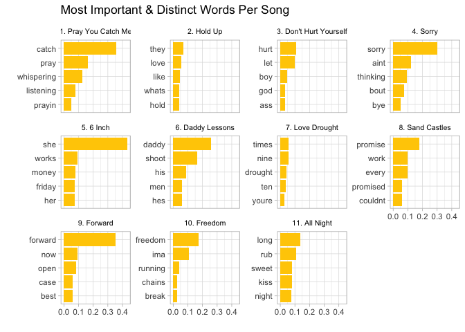
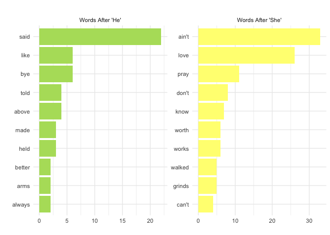
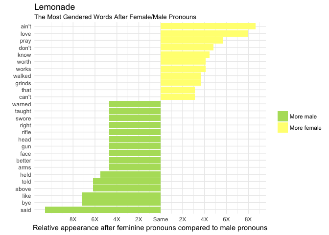
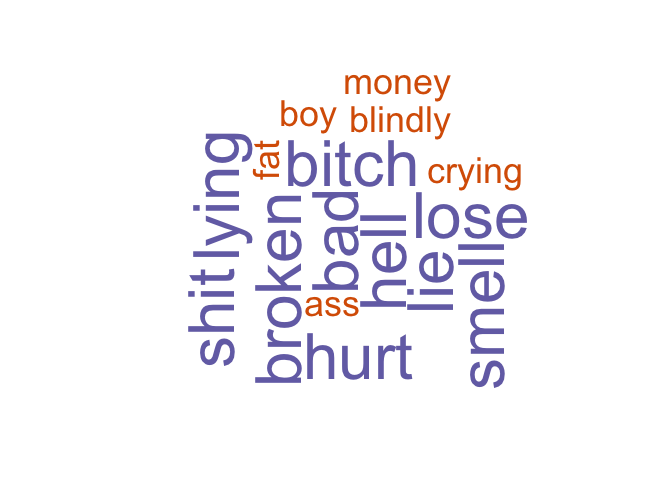

## Data
2016 may be long past, but Beyoncé's vulnerable, powerful and feminist album "Lemonade" will inarguably always be relevant. The album is accompanied by an hour-long film broken into twelve songs and eleven "chapters" all weaving together a narrative of heart break, betrayal, loss, black female empowerment and ultimately hope. The following analysis deep dives into each song's lyrics per chapter. Lyrics were found on [Genius.com](https://genius.com/albums/Beyonce/Lemonade) and transferred to text files for analysis. For the purposes of this analysis, the twelfth song, "Formation" was left out due to it's lack of assignment to a "chapter."

```r
txts <- VCorpus(DirSource(directory = "/Users/sophiebeiers/Documents/GitHub/Lemonade/data/txts"))

txts.df <- read_csv("../data/chps.csv")

meta(txts, type="local", tag="title") <- txts.df$song_title
meta(txts, type="local", tag="chapter")   <- txts.df$chapter

exceptions   <- c("i", "we", "we're", "we've", "we'd", "us", "they", "them", "they've", "they're", "he", "she", "she'll", "she'd", "she's", "you", "you're", "you've", "your","him", "my", "mine", "her", "hers", "his", "him", "sorry")

exceptions2 <- c("sorry", "said")

my_stopwords <- setdiff(stopwords("en"), exceptions)
reg_stopwords <- setdiff(stopwords("en"), exceptions2)

# prepping data
corpus <- tm_map(txts, content_transformer(tolower))
corpus <- tm_map(corpus, stripWhitespace)
corpus <- tm_map(corpus, removePunctuation)
corpus <- tm_map(corpus, removeNumbers)
corpus <- tm_map(corpus, removeWords, my_stopwords)


# document term matrix
doctm <- DocumentTermMatrix(corpus) # create DocumentTermMatrix 
doctm_m <- as.matrix(doctm)

# term document matrix
doc_tdm <- TermDocumentMatrix(corpus)
doc_tdm_m <- as.matrix(doc_tdm)

# tidy object
doc_td <- tidy(doc_tdm)

# merge information
meta <- as_data_frame(str_split_fixed(doc_td$document, "_", n = 3))
colnames(meta) <- c("Order", "Song_title", "Chapter")
doc_td <- as_data_frame(cbind(doc_td, meta))
doc_td$Chapter <- str_sub(doc_td$Chapter, 1, str_length(doc_td$Chapter)-4)

# bag of words
words <- txts.df %>%
  unnest_tokens(word, lyrics) %>% 
  mutate(row = row_number())
```

## Analysis
### Common Words
To begin, I simply split each song into a "bag of words" and counted the most common words that came up throughout the entirity of the album. Unsurprisingly, "love" comes up 81 times; many of the lyrics in Beyoncé's journey reference her relationship with Jay-Z, positively or negatively. Other common words include "sorry," likely from the song "Sorry" in which she explains repeatedly how NOT sorry she is about Jay Z's affair, and "feel," which is certainly fitting given the range of emotions Beyoncé expresses throughout the album.

```r
topwords <- doc_td %>% 
  #anti_join(stop_words, by= c("term" = "word")) %>% 
  filter(!(term %in% reg_stopwords)) %>% 
  group_by(term) %>%
  summarise(n = sum(count)) %>%
  top_n(n = 20, wt = n)  %>%
  ungroup() %>%
  mutate(term = reorder(term, n))


ggplot(data = topwords, aes(term, n)) + 
  geom_bar(stat = "identity", fill = "#ffcc00") + 
  geom_text(aes(label = term, x=term, y = 1), hjust = 0,
            size = 4, color = "#b35900") +
  geom_text(aes(label= n, x=term, y = n-1), hjust = 1, color= 'white') +
  xlab(NULL) +coord_flip() + theme_light() + 
  theme(axis.title = element_blank(), 
        axis.text = element_blank(), 
        axis.ticks = element_blank()) +
  labs(x = '', title = "Most Frequent Words in Beyonce's Lemonade", 
       subtitle = "Number of times word appeared in album")
```

<!-- -->

#### Common Words by Song
Next, I split the words up by song to find which lyrics are most popular in each song. Unsurprisingly, the title of the song is featured in most top 10 lists (i.e. "sorry" in Sorry, "pray" in Pray You Catch Me, "daddy" in Daddy Lessons). From the visualizations, we can also see which songs are more repetetive than others. For instance, the songs "Sorry", "Hold Up" and "All Night" use the top 10 lyrics repeatedly whereas songs like "Forward" and "Love Drought" feature fewer words. 

```r
# order chapters and songs 
doc_td$Song_title[doc_td$Chapter == "Emptiness"] <- "6 Inch"
doc_td$Song_title[doc_td$Chapter == "Anger"] <- "Don't Hurt Yourself"
doc_td$Song_title2 <- paste(doc_td$Order, sep = '. ', doc_td$Song_title)
doc_td$Song_title <- factor(doc_td$Song_title, levels = c("Pray You Catch Me", "Hold Up", "Don't Hurt Yourself", "Sorry", "6 Inch", "Daddy Lessons", "Love Drought", "Sand Castles", "Forward", "Freedom", "All Night"))
doc_td$Song_title2 <- factor(doc_td$Song_title2, levels = c("1. Pray You Catch Me", "2. Hold Up", "3. Don't Hurt Yourself", "4. Sorry", "5. 6 Inch", "6. Daddy Lessons", "7. Love Drought", "8. Sand Castles", "9. Forward", "10. Freedom", "11. All Night"))
doc_td$Chapter <- factor(doc_td$Chapter, levels = c("Intuition", "Denial", "Anger", "Apathy", "Emptiness", "Accountability", "Reformation", "Forgiveness", "Ressurection", "Hope", "Redemption"))

topwords_song <- doc_td %>%
  filter(!(term %in% reg_stopwords)) %>% 
  arrange_(~ desc(count)) %>%
  group_by_(~ Song_title2) %>%
  slice(1:10) %>% 
  select(Song_title2, term, count)


ggplot(data = topwords_song, aes(reorder(term, count), count)) + 
  geom_bar(stat = "identity", fill = "#ffcc00") + 
  coord_flip() + theme_light() + 
  theme(axis.title = element_blank(), 
        axis.text.x =  element_blank(), 
        axis.ticks = element_blank()) +
  labs(x = '', 
       title = "Most Frequent Words in Beyonce's Lemonade", 
       subtitle = "Number of times word appeared in each song") +
  facet_wrap(~Song_title2, scales = "free_y") +
  theme(strip.text = element_text(size=8, color = 'black'),  
        strip.background = element_blank()) 
```

<!-- -->

### Correlation
I ran a correlation analysis on the lyrics of each song to better understand which songs were more like or unlike each other. 

```r
print(xtable(cor(doc_tdm_m), type = "html"))
```

% latex table generated in R 3.4.1 by xtable 1.8-2 package
% Thu Mar 29 12:46:26 2018
\begin{table}[ht]
\centering
\begin{tabular}{rrrrrrrrrrrr}
  \hline
 & 1\_Pray You Catch Me\_Intuition.txt & 10\_Freedom\_Hope.txt & 11\_All Night\_Redemption.txt & 2\_Hold Up\_Denial.txt & 3\_Dont Hurt Yourself\_Anger.txt & 4\_Sorry\_Apathy.txt & 5\_6 Inch\_Emptiness.txt & 6\_Daddy Lessons\_Accountability.txt & 7\_Love Drought\_Reformation.txt & 8\_Sand Castles\_Forgiveness.txt & 9\_Forward\_Ressurection.txt \\ 
  \hline
1\_Pray You Catch Me\_Intuition.txt & 1.00 & 0.16 & 0.25 & 0.45 & 0.50 & 0.19 & 0.00 & 0.11 & 0.59 & 0.10 & 0.08 \\ 
  10\_Freedom\_Hope.txt & 0.16 & 1.00 & 0.10 & 0.23 & 0.23 & 0.07 & -0.03 & 0.01 & 0.24 & 0.10 & 0.04 \\ 
  11\_All Night\_Redemption.txt & 0.25 & 0.10 & 1.00 & 0.45 & 0.38 & 0.13 & 0.01 & 0.06 & 0.38 & 0.11 & 0.15 \\ 
  2\_Hold Up\_Denial.txt & 0.45 & 0.23 & 0.45 & 1.00 & 0.65 & 0.22 & 0.05 & 0.15 & 0.70 & 0.19 & 0.16 \\ 
  3\_Dont Hurt Yourself\_Anger.txt & 0.50 & 0.23 & 0.38 & 0.65 & 1.00 & 0.28 & 0.03 & 0.12 & 0.72 & 0.19 & 0.16 \\ 
  4\_Sorry\_Apathy.txt & 0.19 & 0.07 & 0.13 & 0.22 & 0.28 & 1.00 & -0.01 & 0.04 & 0.29 & 0.03 & 0.03 \\ 
  5\_6 Inch\_Emptiness.txt & 0.00 & -0.03 & 0.01 & 0.05 & 0.03 & -0.01 & 1.00 & -0.02 & 0.02 & 0.07 & -0.01 \\ 
  6\_Daddy Lessons\_Accountability.txt & 0.11 & 0.01 & 0.06 & 0.15 & 0.12 & 0.04 & -0.02 & 1.00 & 0.16 & 0.03 & 0.02 \\ 
  7\_Love Drought\_Reformation.txt & 0.59 & 0.24 & 0.38 & 0.70 & 0.72 & 0.29 & 0.02 & 0.16 & 1.00 & 0.13 & 0.12 \\ 
  8\_Sand Castles\_Forgiveness.txt & 0.10 & 0.10 & 0.11 & 0.19 & 0.19 & 0.03 & 0.07 & 0.03 & 0.13 & 1.00 & 0.16 \\ 
  9\_Forward\_Ressurection.txt & 0.08 & 0.04 & 0.15 & 0.16 & 0.16 & 0.03 & -0.01 & 0.02 & 0.12 & 0.16 & 1.00 \\ 
   \hline
\end{tabular}
\end{table}

### TF - IDF
"TF-IDF" (term frequency-inverse document frequency) reflects the most important words for each song or album by decreasing the weight of words not seen frequently overall and increasing the weight of words not seen very much in the entire album as a whole. Thus, the following words per song are the most unique or important to that song in relation to the word's appearance in the album as a whole. 

We see some interesting themes come up: it's now clear that "6 Inch" now clearly speaks a lot about women ("she", "her") and likely about *empowering* women ("she", "works", "money"). "6 inch" refers to a metaphor for 6-inch heels and seeks to amplify the fierceness and independent power of women! The title "Sand Castles" may not leave us with much, but it's most important words "promise," "work, "couldnt" give us some insight into its topic. In "Sand Castles," Beyoncé reminisces about her flawed but beautiful relationship with Jay Z. Promises were kept, promises were broken. The emotion! 


```r
# tf_idf
doc_tf_idf <-  doc_td %>%
                bind_tf_idf(term, document, count) %>%  
                arrange(desc(tf_idf))

doc_tf_idf %>% 
  filter(!(term %in% c("can","said"))) %>% 
  arrange_(~ desc(tf_idf)) %>% 
  group_by(Song_title2) %>% 
  slice(1:5) %>% 
ggplot(aes(x = reorder(term, desc(-tf_idf)), y = tf_idf)) +
  geom_bar(stat = "identity", fill = "#ffcc00") + coord_flip() +
  facet_wrap(~ Song_title2, scales="free_y") + 
  theme(axis.title = element_blank(), 
        axis.text.x =  element_blank(), 
        axis.ticks = element_blank()) +
  labs(x = '', y = '', title = "Most Important & Distinct Words Per Song") +
  theme_light() +
  theme(strip.text = element_text(size=8, color = 'black'),  
        strip.background = element_blank()) 
```

<!-- -->

### Unique Words
I next looked into how many words were unique in each song. 


```r
# need to reorder
doc_td %>% 
  group_by(Song_title) %>% 
  mutate(unq_wrds = length(term)) %>% 
  select(Song_title, unq_wrds) %>% 
  unique() %>% 
ggplot(aes(x = reorder(Song_title, unq_wrds), y = unq_wrds)) +
         geom_segment(aes(x = Song_title, y = 0, xend = Song_title, yend = unq_wrds),
                          color = "#ffcc00", size = .5) +
         geom_point(size = 7, color = "#ffcc00") +
         geom_text(aes(label = unq_wrds), color = "black", size = 3, check_overlap = TRUE) +
         labs(x = "", y = "", title = "Number of Unique Words Per Song") +
         theme_light() +
         coord_flip() +
         theme(legend.position="none") +
         theme(
               axis.text.x =  element_blank(), 
               axis.ticks = element_blank()) 
```

<!-- -->

### He/She

```r
# words set up
pronouns <- c("i", "we", "us", "they", "them", "he", "she", "shes", "you", "him", "her", "hers", "my", "mine")
fem_wrds <- c("her", "hers", "she","shes", "hers", "woman", "women", "girl", "girls", "mother", "i", "daughter", "daughters", "sister", "sisters", "momma", "Becky", "wife", "herself")
male_wrds <- c("he", "his", "hes", "man", "men", "mans", "boy", "boys", "daddy", "son", "sons", "brother", "brothers", "father")
together_wrds <- c("we", "us", "together")
you_wrds <- c("you", "your", "youre")
i_words <- c("i", "im", "me", "my")

# gender analysis 
shehe_song <- doc_td %>%
  filter((term %in% fem_wrds|term %in% male_wrds)) %>% 
  arrange_(~ desc(count)) %>%
  group_by_(~ Song_title) %>%
  select(Song_title, term, count)

shehe_song$male <- ifelse(shehe_song$term %in% male_wrds, -(shehe_song$count), 0)
shehe_song$female <- ifelse(shehe_song$term %in% fem_wrds, shehe_song$count, 0)
shehe_song$gender <- shehe_song$female + shehe_song$male

shehe_song <- shehe_song %>% 
  dplyr::group_by(Song_title) %>% 
  dplyr::mutate(gender2 = sum(gender))
shehe_song <- shehe_song %>% 
  dplyr::group_by(Song_title) %>% 
  dplyr::mutate(female2 = sum(female), male2 = sum(male))
shehe_song$gendertot <- ifelse(shehe_song$gender2 > 0, "female", "male")
shehe_song$gendertot <- factor(shehe_song$gendertot, levels = c("female", "male"))

# visualization 
ggplot(shehe_song, aes(x = Song_title, y = gender2)) +
  geom_segment(data = filter(shehe_song, male2 < 0),
               aes(x = Song_title, y = 0, 
                   xend = Song_title, yend = male2, color = "Words about Males"), 
               inherit.aes = FALSE, 
               arrow = arrow(length = unit(0.1, "inches"), ends = "last")) +
  geom_segment(data = filter(shehe_song, female2 > 1),
               aes(x = Song_title, y = 0, xend = Song_title, 
                   yend = female2, color = "Words about Females"),
               inherit.aes = FALSE,
               arrow = arrow(length = unit(0.1, "inches"), ends = "last")) +
  scale_color_manual(values=c("#ffcc00","#b3de69"), name = "") +
  coord_flip() +
  theme_light() +
  labs(x = '', y = '', title = 'He/She in Lemonade Songs', 
       caption = "(number of female or male pronouns used in each song) ") +
  theme(legend.position="top") +
  theme(axis.ticks = element_blank())
```

<!-- -->

#### Bigrams

```r
# she/he bigrams 
bigrams <- txts.df %>%
  unnest_tokens(bigram, lyrics, token = "ngrams", n = 2) %>% 
  separate(bigram, c("word1", "word2"), sep = " ")

she_bigram <- bigrams %>% 
  filter(word1 %in% fem_wrds) %>% 
  count(word2, sort = TRUE) %>% 
  slice(1:10)
she_bigram$type <- "Words After 'She'"
colnames(she_bigram)[1] <- "word"


he_bigram <- bigrams %>% 
  filter(word1 %in% male_wrds) %>% 
  count(word2, sort = TRUE) %>% 
  slice(1:10)
he_bigram$type <- "Words After 'He'"
colnames(he_bigram)[1] <- "word"

bigrams_top10 <- rbind(she_bigram, he_bigram)

ggplot(data = bigrams_top10, aes(x = reorder(word, desc(-n)), y = n)) +
  geom_bar(aes(fill = type), stat = "identity") + coord_flip() +
  theme(axis.title = element_blank(), 
        axis.text.x =  element_blank(), 
        axis.ticks = element_blank()) +
  scale_fill_manual(values=c("#b3de69","#ffff80")) +
  labs(x = '', y = '', title = "") +
  facet_wrap(~type, scales = "free") +
  theme_minimal(base_size = 11) +
  theme(legend.position = "none")
```

<!-- -->

The below idea was taken from an R-bloggers article on the "[Weinsten Effect](https://www.r-bloggers.com/a-tidytext-analysis-of-the-weinstein-effect/)," but I adapted it for Lemonade analysis. First, I transform the bigrams into a log ratio of she/he. Thus, the sign of the log ratio indicates whether the second word appears more after she (positive) or he (negative) and the absolute value of the log ratio indicates the magnitude. Below, we can see which words appear after he and she relative to the other gendered word. 

Several trends emerge: first, we see that "he" (likely mainly Jay-Z) *says*, *tells*, and *swears* (likely as in "promises") a lot. Does he stick to his word? There's also a fair amount of violence associated to the male pronoun. When Beyoncé talks about girls/women, they emote and DO more (with words like "love", "pray", "worked", "grinds"). 


```r
# change words so any fem words become "she" and any male words become "he"
bigrams$word1 <- ifelse(bigrams$word1 %in% male_wrds, "he", bigrams$word1)
bigrams$word1 <- ifelse(bigrams$word1 %in% fem_wrds, "she", bigrams$word1)

# code borrowed from: https://www.r-bloggers.com/a-tidytext-analysis-of-the-weinstein-effect/
he_she_bigram <- bigrams %>%
  filter(word1 %in% c("he", "she"))

he_she_bigram <- he_she_bigram %>%
  count(word1, word2) %>%
  spread(word1, n, fill = 0) %>%
  mutate(total = he + she,
         he = (he + 1) / sum(he + 1),
         she = (she + 1) / sum(she + 1),
         log.ratio = log2(she / he),
         abs.ratio = abs(log.ratio)) %>%
  arrange(desc(log.ratio))

he_she_bigram %>%
  group_by(direction = ifelse(log.ratio > 0, 'More "she"', "More 'he'")) %>%
  top_n(10, abs.ratio) %>%
  ungroup() %>%
  mutate(word2 = reorder(word2, log.ratio)) %>%
  ggplot(aes(word2, log.ratio, fill = direction)) +
  geom_col() +
  coord_flip() +
  labs(x = "",
       y = 'Relative appearance after "she" compared to "he"',
       fill = "",
       title = "Lemonade",
       subtitle = "The Most Gendered Words After Female/Male Pronouns") +
  scale_fill_manual(values=c("#b3de69","#ffff80")) +
  scale_y_continuous(labels = c("8X", "6X", "4X", "2X", "Same", "2X", "4X", "6X", "8X"),
                     breaks = seq(-4, 4)) +
  guides(fill = guide_legend(reverse = TRUE)) +
  expand_limits(y = c(-4, 4)) +
  theme_minimal()
```

<!-- -->

### Emotional Range 

Lemonade is EMOTIONAL and raw, no doubt, but do the titles of each Chapter correctly label the emotion at hand? To better understand the true emotional range of Lemonade, I joined the "AFINN" lexicon to the album lyrics, which rates the magnitude of positivity and negativity to each word on a scale of -5 (most negative) to 5 (most positive). I then created a cumulative counter that added each negative or positive score to the previous word's score. In the end, we can see the emotional (positive vs. negative) flow of the album in its entirety. 

Intuition and Denial start us off strong, then the album takes a negative turn when we get to Anger and Apathy. Things remain fairly negative throughout Emptiness, Accountability and Forgiveness, then Resurrection, Hope and ultimately Redemption bring us way back up and let us end on a high note. I would guess that the spurts of positive words within Emptiness and Accountability are likely words like "like" or "love" but are actually being talked about in a more sad, negative way. 


```r
# get sentiments lexicon
afinn <- get_sentiments("afinn")    
words <- words %>%
  inner_join(afinn)

# loop over rows to add up score 
x = 0
for (i in seq(1:502)) {
  words$tot[i] <- words$score[i] + x
  x =  words$tot[i]
}

# reset index 
words <- words %>% 
  mutate(row = row_number())

# create order to chapters

words$chapter_txt <- ifelse(words$chapter == "Intuition", "1. Intuition", words$chapter)
words$chapter_txt <- ifelse(words$chapter == "Denial", "2. Denial", words$chapter_txt)
words$chapter_txt <- ifelse(words$chapter == "Anger", "3. Anger", words$chapter_txt)
words$chapter_txt <- ifelse(words$chapter == "Apathy", "4. Apathy", words$chapter_txt)
words$chapter_txt <- ifelse(words$chapter == "Emptiness", "5. Emptiness", words$chapter_txt)
words$chapter_txt <- ifelse(words$chapter == "Accountability", "6. Accountability", words$chapter_txt)
words$chapter_txt <- ifelse(words$chapter == "Reformation", "7. Reformation", words$chapter_txt)
words$chapter_txt <- ifelse(words$chapter == "Forgiveness", "8. Forgiveness", words$chapter_txt)
words$chapter_txt <- ifelse(words$chapter == "Ressurection", "9. Ressurection", words$chapter_txt)
words$chapter_txt <- ifelse(words$chapter == "Hope", "10. Hope", words$chapter_txt)
words$chapter_txt <- ifelse(words$chapter == "Redemption", "11. Redemption", words$chapter_txt)
words$chapter_txt <- factor(words$chapter_txt, levels = c("1. Intuition", "2. Denial", "3. Anger", "4. Apathy", "5. Emptiness", "6. Accountability", "7. Reformation", "8. Forgiveness", "9. Ressurection", "10. Hope", "11. Redemption"))

words <- filter(words, !is.na(words$chapter))
words$chapter <- factor(words$chapter, levels = c("Intuition", "Denial", "Anger", "Apathy", "Emptiness", "Accountability", "Reformation", "Forgiveness", "Ressurection", "Hope", "Redemption"))


# over time visualization
ggplot(data = words, aes(x = row, y = tot)) +
  geom_area(aes(fill = chapter_txt), alpha = 0.9, color = "white") +
    scale_fill_manual(values=c("#ffff80","#ffff33", "#FFA500","#FF8C00", "#FF6126", "#FF4500", "#FF6347", "#FF8C00", "#ffca50", "#ffdb66", "#ff8172"), name = "Chapter") +
  labs(x = '', y = '', title = 'Lemonade: Emotional Range of Chapters Over Time\n', subtitle = '') +
  ggplot2::annotate(geom = "text", x = 5, y = 100, 
                    label = "Positive Words", size = 3, hjust = -0.1, vjust = -.1) +
  ggplot2::annotate("text", x = 5, y = 80, 
                    label = "Negative Words",  
                    size = 3, hjust = -0.1, vjust = -.1) +
    ggplot2::annotate("text", x = 200, y = 150, 
                    label = "Album Chapters",  
                    size = 3, hjust = -0.1, vjust = -.1) +
        geom_segment(aes(x = 0, xend = 0 , y = 100, yend = 130),
                     arrow = arrow(length = unit(0.2,"cm")), color = "#99ff33") +
        geom_segment(aes(x = 0, xend = 0 , y = 80, yend = 50),
                     arrow = arrow(length = unit(0.2,"cm")), color = "#F8766D") +
        geom_segment(aes(x = 275, xend = 315 , y = 152, yend = 152),
                     arrow = arrow(length = unit(0.2,"cm")), color = "gray") +
  theme_void() +
  theme(axis.text = element_blank(), 
        axis.ticks = element_blank(),
        legend.position = "top")
```

<!-- -->

Lastly, I made the visualization interactive so that the user can scroll over the plot and see the Chapter title, song title and word at hand that contributes to the positive or negative accumulation over time. 


```r
## An attempt at interactivity 
library(plotly)
colnames(words)[colnames(words) == "chapter_txt"] <- "Chapter"
emo <- ggplot(data = words, aes(x = row, y = tot)) +
  geom_area(aes(fill = Chapter, label = word, text = song_title), alpha = 0.9, color = "white") +
    scale_fill_manual(values=c("#ffff80","#ffff33", "#FFA500","#FF8C00", "#FF6126", "#FF4500", "#FF6347", "#FF8C00", "#ffca50", "#ffdb66", "#ff8172"), name = "Chapter") +
  labs(x = '', y = '', title = 'Lemonade: Emotional Range of Chapters Over Time\n', subtitle = '') +
  theme_void() +
  theme(text=element_text(size=16, 
        family="Serif")) +
  theme(axis.text = element_blank(), 
        axis.ticks = element_blank(),
        legend.position = "none") 

# emo <- emo %>%  
# add_fun(function(emo) {
#     emo %>% 
#       add_segments(x = 0, xend = 0, y = 100, yend = 175) %>% 
#       add_annotations("Minimum uncertainty")
#   })

ggplotly(p = emo, tooltip = c("Chapter", "song_title", "word"))
```

<!--html_preserve--><div id="116e6469908f8" style="width:672px;height:480px;" class="plotly html-widget"></div>
<script type="application/json" data-for="116e6469908f8">{"x":{"data":[{"x":[1,2,3,4,5,6,7,8,9,10,11,12,13,14,15,16,17,18,18,17,16,15,14,13,12,11,10,9,8,7,6,5,4,3,2,1,1],"y":[-2,-1,0,0,0,0,0,0,0,0,0,0,0,0,0,0,0,0,15,14,13,12,11,10,9,8,7,5,3,1,3,2,1,0,0,0,-2],"text":["Chapter: 1. Intuition<br />word: lonely<br />Pray You Catch Me","Chapter: 1. Intuition<br />word: pray<br />Pray You Catch Me","Chapter: 1. Intuition<br />word: pray<br />Pray You Catch Me","Chapter: 1. Intuition<br />word: pray<br />Pray You Catch Me","Chapter: 1. Intuition<br />word: pray<br />Pray You Catch Me","Chapter: 1. Intuition<br />word: pray<br />Pray You Catch Me","Chapter: 1. Intuition<br />word: hurt<br />Pray You Catch Me","Chapter: 1. Intuition<br />word: like<br />Pray You Catch Me","Chapter: 1. Intuition<br />word: smile<br />Pray You Catch Me","Chapter: 1. Intuition<br />word: ease<br />Pray You Catch Me","Chapter: 1. Intuition<br />word: pray<br />Pray You Catch Me","Chapter: 1. Intuition<br />word: pray<br />Pray You Catch Me","Chapter: 1. Intuition<br />word: pray<br />Pray You Catch Me","Chapter: 1. Intuition<br />word: pray<br />Pray You Catch Me","Chapter: 1. Intuition<br />word: pray<br />Pray You Catch Me","Chapter: 1. Intuition<br />word: pray<br />Pray You Catch Me","Chapter: 1. Intuition<br />word: pray<br />Pray You Catch Me","Chapter: 1. Intuition<br />word: praying<br />Pray You Catch Me","Chapter: 1. Intuition<br />word: praying<br />Pray You Catch Me","Chapter: 1. Intuition<br />word: pray<br />Pray You Catch Me","Chapter: 1. Intuition<br />word: pray<br />Pray You Catch Me","Chapter: 1. Intuition<br />word: pray<br />Pray You Catch Me","Chapter: 1. Intuition<br />word: pray<br />Pray You Catch Me","Chapter: 1. Intuition<br />word: pray<br />Pray You Catch Me","Chapter: 1. Intuition<br />word: pray<br />Pray You Catch Me","Chapter: 1. Intuition<br />word: pray<br />Pray You Catch Me","Chapter: 1. Intuition<br />word: ease<br />Pray You Catch Me","Chapter: 1. Intuition<br />word: smile<br />Pray You Catch Me","Chapter: 1. Intuition<br />word: like<br />Pray You Catch Me","Chapter: 1. Intuition<br />word: hurt<br />Pray You Catch Me","Chapter: 1. Intuition<br />word: pray<br />Pray You Catch Me","Chapter: 1. Intuition<br />word: pray<br />Pray You Catch Me","Chapter: 1. Intuition<br />word: pray<br />Pray You Catch Me","Chapter: 1. Intuition<br />word: pray<br />Pray You Catch Me","Chapter: 1. Intuition<br />word: pray<br />Pray You Catch Me","Chapter: 1. Intuition<br />word: lonely<br />Pray You Catch Me","Chapter: 1. Intuition<br />word: lonely<br />Pray You Catch Me"],"type":"scatter","mode":"lines","line":{"width":1.88976377952756,"color":"rgba(255,255,255,0.9)","dash":"solid"},"fill":"toself","fillcolor":"rgba(255,255,128,0.9)","hoveron":"points","name":"1. Intuition","legendgroup":"1. Intuition","showlegend":true,"xaxis":"x","yaxis":"y","hoverinfo":"text","frame":null},{"x":[19,20,21,22,23,24,25,26,27,28,29,30,31,32,33,34,35,36,37,38,39,40,41,42,43,44,45,46,47,48,49,50,51,52,53,54,55,56,57,58,59,60,61,62,63,64,65,66,67,68,69,70,71,72,73,74,75,76,77,78,79,80,81,82,83,84,85,86,87,88,89,90,91,92,93,94,95,96,97,98,99,100,101,102,103,104,105,106,107,108,109,110,111,112,113,114,115,116,117,118,119,120,121,122,123,124,125,126,127,128,129,130,130,129,128,127,126,125,124,123,122,121,120,119,118,117,116,115,114,113,112,111,110,109,108,107,106,105,104,103,102,101,100,99,98,97,96,95,94,93,92,91,90,89,88,87,86,85,84,83,82,81,80,79,78,77,76,75,74,73,72,71,70,69,68,67,66,65,64,63,62,61,60,59,58,57,56,55,54,53,52,51,50,49,48,47,46,45,44,43,42,41,40,39,38,37,36,35,34,33,32,31,30,29,28,27,26,25,24,23,22,21,20,19,19],"y":[0,0,0,0,0,0,0,0,0,0,0,0,0,0,0,0,0,0,0,0,0,0,0,0,0,0,0,0,0,0,0,0,0,0,0,0,0,0,0,0,0,0,0,0,0,0,0,0,0,0,0,0,0,0,0,0,0,0,0,0,0,0,0,0,0,0,0,0,0,0,0,0,0,0,0,0,0,0,0,0,0,0,0,0,0,0,0,0,0,0,0,0,0,0,0,0,0,0,0,0,0,0,0,0,0,0,0,0,0,0,0,0,182,179,177,174,171,169,166,168,169,166,164,161,158,156,153,150,148,145,142,140,137,139,137,139,141,143,145,148,146,144,142,140,141,138,135,137,134,132,129,126,124,121,123,124,121,119,116,113,111,108,105,103,100,97,95,92,93,94,91,88,86,83,80,78,75,77,78,75,73,70,67,65,62,59,57,54,51,49,46,48,46,48,50,52,54,57,59,55,52,57,61,63,60,57,55,52,49,47,44,46,47,44,42,39,36,34,31,28,26,23,20,18,0],"text":["Chapter: 2. Denial<br />word: love<br />Hold Up","Chapter: 2. Denial<br />word: like<br />Hold Up","Chapter: 2. Denial<br />word: love<br />Hold Up","Chapter: 2. Denial<br />word: love<br />Hold Up","Chapter: 2. Denial<br />word: like<br />Hold Up","Chapter: 2. Denial<br />word: love<br />Hold Up","Chapter: 2. Denial<br />word: love<br />Hold Up","Chapter: 2. Denial<br />word: like<br />Hold Up","Chapter: 2. Denial<br />word: love<br />Hold Up","Chapter: 2. Denial<br />word: love<br />Hold Up","Chapter: 2. Denial<br />word: like<br />Hold Up","Chapter: 2. Denial<br />word: love<br />Hold Up","Chapter: 2. Denial<br />word: no<br />Hold Up","Chapter: 2. Denial<br />word: wicked<br />Hold Up","Chapter: 2. Denial<br />word: love<br />Hold Up","Chapter: 2. Denial<br />word: like<br />Hold Up","Chapter: 2. Denial<br />word: love<br />Hold Up","Chapter: 2. Denial<br />word: love<br />Hold Up","Chapter: 2. Denial<br />word: like<br />Hold Up","Chapter: 2. Denial<br />word: love<br />Hold Up","Chapter: 2. Denial<br />word: perfect<br />Hold Up","Chapter: 2. Denial<br />word: worthless<br />Hold Up","Chapter: 2. Denial<br />word: fuck<br />Hold Up","Chapter: 2. Denial<br />word: bitch<br />Hold Up","Chapter: 2. Denial<br />word: sexy<br />Hold Up","Chapter: 2. Denial<br />word: fun<br />Hold Up","Chapter: 2. Denial<br />word: missing<br />Hold Up","Chapter: 2. Denial<br />word: worse<br />Hold Up","Chapter: 2. Denial<br />word: jealous<br />Hold Up","Chapter: 2. Denial<br />word: crazy<br />Hold Up","Chapter: 2. Denial<br />word: jealous<br />Hold Up","Chapter: 2. Denial<br />word: crazy<br />Hold Up","Chapter: 2. Denial<br />word: like<br />Hold Up","Chapter: 2. Denial<br />word: crazy<br />Hold Up","Chapter: 2. Denial<br />word: love<br />Hold Up","Chapter: 2. Denial<br />word: like<br />Hold Up","Chapter: 2. Denial<br />word: love<br />Hold Up","Chapter: 2. Denial<br />word: love<br />Hold Up","Chapter: 2. Denial<br />word: like<br />Hold Up","Chapter: 2. Denial<br />word: love<br />Hold Up","Chapter: 2. Denial<br />word: love<br />Hold Up","Chapter: 2. Denial<br />word: like<br />Hold Up","Chapter: 2. Denial<br />word: love<br />Hold Up","Chapter: 2. Denial<br />word: love<br />Hold Up","Chapter: 2. Denial<br />word: like<br />Hold Up","Chapter: 2. Denial<br />word: love<br />Hold Up","Chapter: 2. Denial<br />word: no<br />Hold Up","Chapter: 2. Denial<br />word: wicked<br />Hold Up","Chapter: 2. Denial<br />word: love<br />Hold Up","Chapter: 2. Denial<br />word: like<br />Hold Up","Chapter: 2. Denial<br />word: love<br />Hold Up","Chapter: 2. Denial<br />word: love<br />Hold Up","Chapter: 2. Denial<br />word: like<br />Hold Up","Chapter: 2. Denial<br />word: love<br />Hold Up","Chapter: 2. Denial<br />word: wealth<br />Hold Up","Chapter: 2. Denial<br />word: no<br />Hold Up","Chapter: 2. Denial<br />word: hide<br />Hold Up","Chapter: 2. Denial<br />word: love<br />Hold Up","Chapter: 2. Denial<br />word: like<br />Hold Up","Chapter: 2. Denial<br />word: love<br />Hold Up","Chapter: 2. Denial<br />word: love<br />Hold Up","Chapter: 2. Denial<br />word: like<br />Hold Up","Chapter: 2. Denial<br />word: love<br />Hold Up","Chapter: 2. Denial<br />word: love<br />Hold Up","Chapter: 2. Denial<br />word: like<br />Hold Up","Chapter: 2. Denial<br />word: love<br />Hold Up","Chapter: 2. Denial<br />word: love<br />Hold Up","Chapter: 2. Denial<br />word: like<br />Hold Up","Chapter: 2. Denial<br />word: love<br />Hold Up","Chapter: 2. Denial<br />word: no<br />Hold Up","Chapter: 2. Denial<br />word: wicked<br />Hold Up","Chapter: 2. Denial<br />word: love<br />Hold Up","Chapter: 2. Denial<br />word: like<br />Hold Up","Chapter: 2. Denial<br />word: love<br />Hold Up","Chapter: 2. Denial<br />word: love<br />Hold Up","Chapter: 2. Denial<br />word: like<br />Hold Up","Chapter: 2. Denial<br />word: love<br />Hold Up","Chapter: 2. Denial<br />word: shame<br />Hold Up","Chapter: 2. Denial<br />word: good<br />Hold Up","Chapter: 2. Denial<br />word: love<br />Hold Up","Chapter: 2. Denial<br />word: waste<br />Hold Up","Chapter: 2. Denial<br />word: top<br />Hold Up","Chapter: 2. Denial<br />word: like<br />Hold Up","Chapter: 2. Denial<br />word: like<br />Hold Up","Chapter: 2. Denial<br />word: like<br />Hold Up","Chapter: 2. Denial<br />word: worse<br />Hold Up","Chapter: 2. Denial<br />word: jealous<br />Hold Up","Chapter: 2. Denial<br />word: crazy<br />Hold Up","Chapter: 2. Denial<br />word: jealous<br />Hold Up","Chapter: 2. Denial<br />word: crazy<br />Hold Up","Chapter: 2. Denial<br />word: like<br />Hold Up","Chapter: 2. Denial<br />word: crazy<br />Hold Up","Chapter: 2. Denial<br />word: love<br />Hold Up","Chapter: 2. Denial<br />word: like<br />Hold Up","Chapter: 2. Denial<br />word: love<br />Hold Up","Chapter: 2. Denial<br />word: love<br />Hold Up","Chapter: 2. Denial<br />word: like<br />Hold Up","Chapter: 2. Denial<br />word: love<br />Hold Up","Chapter: 2. Denial<br />word: love<br />Hold Up","Chapter: 2. Denial<br />word: like<br />Hold Up","Chapter: 2. Denial<br />word: love<br />Hold Up","Chapter: 2. Denial<br />word: love<br />Hold Up","Chapter: 2. Denial<br />word: like<br />Hold Up","Chapter: 2. Denial<br />word: love<br />Hold Up","Chapter: 2. Denial<br />word: no<br />Hold Up","Chapter: 2. Denial<br />word: wicked<br />Hold Up","Chapter: 2. Denial<br />word: love<br />Hold Up","Chapter: 2. Denial<br />word: like<br />Hold Up","Chapter: 2. Denial<br />word: love<br />Hold Up","Chapter: 2. Denial<br />word: love<br />Hold Up","Chapter: 2. Denial<br />word: like<br />Hold Up","Chapter: 2. Denial<br />word: love<br />Hold Up","Chapter: 2. Denial<br />word: love<br />Hold Up","Chapter: 2. Denial<br />word: like<br />Hold Up","Chapter: 2. Denial<br />word: love<br />Hold Up","Chapter: 2. Denial<br />word: love<br />Hold Up","Chapter: 2. Denial<br />word: like<br />Hold Up","Chapter: 2. Denial<br />word: love<br />Hold Up","Chapter: 2. Denial<br />word: wicked<br />Hold Up","Chapter: 2. Denial<br />word: no<br />Hold Up","Chapter: 2. Denial<br />word: love<br />Hold Up","Chapter: 2. Denial<br />word: like<br />Hold Up","Chapter: 2. Denial<br />word: love<br />Hold Up","Chapter: 2. Denial<br />word: love<br />Hold Up","Chapter: 2. Denial<br />word: like<br />Hold Up","Chapter: 2. Denial<br />word: love<br />Hold Up","Chapter: 2. Denial<br />word: love<br />Hold Up","Chapter: 2. Denial<br />word: like<br />Hold Up","Chapter: 2. Denial<br />word: love<br />Hold Up","Chapter: 2. Denial<br />word: love<br />Hold Up","Chapter: 2. Denial<br />word: like<br />Hold Up","Chapter: 2. Denial<br />word: love<br />Hold Up","Chapter: 2. Denial<br />word: crazy<br />Hold Up","Chapter: 2. Denial<br />word: like<br />Hold Up","Chapter: 2. Denial<br />word: crazy<br />Hold Up","Chapter: 2. Denial<br />word: jealous<br />Hold Up","Chapter: 2. Denial<br />word: crazy<br />Hold Up","Chapter: 2. Denial<br />word: jealous<br />Hold Up","Chapter: 2. Denial<br />word: worse<br />Hold Up","Chapter: 2. Denial<br />word: like<br />Hold Up","Chapter: 2. Denial<br />word: like<br />Hold Up","Chapter: 2. Denial<br />word: like<br />Hold Up","Chapter: 2. Denial<br />word: top<br />Hold Up","Chapter: 2. Denial<br />word: waste<br />Hold Up","Chapter: 2. Denial<br />word: love<br />Hold Up","Chapter: 2. Denial<br />word: good<br />Hold Up","Chapter: 2. Denial<br />word: shame<br />Hold Up","Chapter: 2. Denial<br />word: love<br />Hold Up","Chapter: 2. Denial<br />word: like<br />Hold Up","Chapter: 2. Denial<br />word: love<br />Hold Up","Chapter: 2. Denial<br />word: love<br />Hold Up","Chapter: 2. Denial<br />word: like<br />Hold Up","Chapter: 2. Denial<br />word: love<br />Hold Up","Chapter: 2. Denial<br />word: wicked<br />Hold Up","Chapter: 2. Denial<br />word: no<br />Hold Up","Chapter: 2. Denial<br />word: love<br />Hold Up","Chapter: 2. Denial<br />word: like<br />Hold Up","Chapter: 2. Denial<br />word: love<br />Hold Up","Chapter: 2. Denial<br />word: love<br />Hold Up","Chapter: 2. Denial<br />word: like<br />Hold Up","Chapter: 2. Denial<br />word: love<br />Hold Up","Chapter: 2. Denial<br />word: love<br />Hold Up","Chapter: 2. Denial<br />word: like<br />Hold Up","Chapter: 2. Denial<br />word: love<br />Hold Up","Chapter: 2. Denial<br />word: love<br />Hold Up","Chapter: 2. Denial<br />word: like<br />Hold Up","Chapter: 2. Denial<br />word: love<br />Hold Up","Chapter: 2. Denial<br />word: hide<br />Hold Up","Chapter: 2. Denial<br />word: no<br />Hold Up","Chapter: 2. Denial<br />word: wealth<br />Hold Up","Chapter: 2. Denial<br />word: love<br />Hold Up","Chapter: 2. Denial<br />word: like<br />Hold Up","Chapter: 2. Denial<br />word: love<br />Hold Up","Chapter: 2. Denial<br />word: love<br />Hold Up","Chapter: 2. Denial<br />word: like<br />Hold Up","Chapter: 2. Denial<br />word: love<br />Hold Up","Chapter: 2. Denial<br />word: wicked<br />Hold Up","Chapter: 2. Denial<br />word: no<br />Hold Up","Chapter: 2. Denial<br />word: love<br />Hold Up","Chapter: 2. Denial<br />word: like<br />Hold Up","Chapter: 2. Denial<br />word: love<br />Hold Up","Chapter: 2. Denial<br />word: love<br />Hold Up","Chapter: 2. Denial<br />word: like<br />Hold Up","Chapter: 2. Denial<br />word: love<br />Hold Up","Chapter: 2. Denial<br />word: love<br />Hold Up","Chapter: 2. Denial<br />word: like<br />Hold Up","Chapter: 2. Denial<br />word: love<br />Hold Up","Chapter: 2. Denial<br />word: love<br />Hold Up","Chapter: 2. Denial<br />word: like<br />Hold Up","Chapter: 2. Denial<br />word: love<br />Hold Up","Chapter: 2. Denial<br />word: crazy<br />Hold Up","Chapter: 2. Denial<br />word: like<br />Hold Up","Chapter: 2. Denial<br />word: crazy<br />Hold Up","Chapter: 2. Denial<br />word: jealous<br />Hold Up","Chapter: 2. Denial<br />word: crazy<br />Hold Up","Chapter: 2. Denial<br />word: jealous<br />Hold Up","Chapter: 2. Denial<br />word: worse<br />Hold Up","Chapter: 2. Denial<br />word: missing<br />Hold Up","Chapter: 2. Denial<br />word: fun<br />Hold Up","Chapter: 2. Denial<br />word: sexy<br />Hold Up","Chapter: 2. Denial<br />word: bitch<br />Hold Up","Chapter: 2. Denial<br />word: fuck<br />Hold Up","Chapter: 2. Denial<br />word: worthless<br />Hold Up","Chapter: 2. Denial<br />word: perfect<br />Hold Up","Chapter: 2. Denial<br />word: love<br />Hold Up","Chapter: 2. Denial<br />word: like<br />Hold Up","Chapter: 2. Denial<br />word: love<br />Hold Up","Chapter: 2. Denial<br />word: love<br />Hold Up","Chapter: 2. Denial<br />word: like<br />Hold Up","Chapter: 2. Denial<br />word: love<br />Hold Up","Chapter: 2. Denial<br />word: wicked<br />Hold Up","Chapter: 2. Denial<br />word: no<br />Hold Up","Chapter: 2. Denial<br />word: love<br />Hold Up","Chapter: 2. Denial<br />word: like<br />Hold Up","Chapter: 2. Denial<br />word: love<br />Hold Up","Chapter: 2. Denial<br />word: love<br />Hold Up","Chapter: 2. Denial<br />word: like<br />Hold Up","Chapter: 2. Denial<br />word: love<br />Hold Up","Chapter: 2. Denial<br />word: love<br />Hold Up","Chapter: 2. Denial<br />word: like<br />Hold Up","Chapter: 2. Denial<br />word: love<br />Hold Up","Chapter: 2. Denial<br />word: love<br />Hold Up","Chapter: 2. Denial<br />word: like<br />Hold Up","Chapter: 2. Denial<br />word: love<br />Hold Up","Chapter: 2. Denial<br />word: love<br />Hold Up"],"type":"scatter","mode":"lines","line":{"width":1.88976377952756,"color":"rgba(255,255,255,0.9)","dash":"solid"},"fill":"toself","fillcolor":"rgba(255,255,51,0.9)","hoveron":"points","name":"2. Denial","legendgroup":"2. Denial","showlegend":true,"xaxis":"x","yaxis":"y","hoverinfo":"text","frame":null},{"x":[131,132,133,134,135,136,137,138,139,140,141,142,143,144,145,146,147,148,149,150,151,152,153,154,155,156,157,158,159,160,161,162,163,164,165,166,167,168,169,170,171,172,173,174,175,176,177,178,179,180,181,182,183,184,185,186,187,188,189,189,188,187,186,185,184,183,182,181,180,179,178,177,176,175,174,173,172,171,170,169,168,167,166,165,164,163,162,161,160,159,158,157,156,155,154,153,152,151,150,149,148,147,146,145,144,143,142,141,140,139,138,137,136,135,134,133,132,131,131],"y":[0,0,0,0,0,0,0,0,0,0,0,0,0,0,0,0,0,0,0,0,0,0,0,0,0,0,0,0,0,0,0,0,0,0,0,0,0,0,0,0,0,0,0,0,0,0,0,0,0,0,0,0,0,0,0,0,0,0,0,121,125,128,127,124,121,118,120,122,124,126,130,134,132,131,135,139,136,135,132,133,131,132,134,136,137,134,131,133,132,129,126,123,125,127,129,131,133,135,137,139,140,144,145,146,150,154,153,152,157,160,162,160,164,168,173,174,178,180,0],"text":["Chapter: 3. Anger<br />word: hurt<br />Don’t Hurt Yourself","Chapter: 3. Anger<br />word: hurt<br />Don’t Hurt Yourself","Chapter: 3. Anger<br />word: fuck<br />Don’t Hurt Yourself","Chapter: 3. Anger<br />word: no<br />Don’t Hurt Yourself","Chapter: 3. Anger<br />word: bitch<br />Don’t Hurt Yourself","Chapter: 3. Anger<br />word: ass<br />Don’t Hurt Yourself","Chapter: 3. Anger<br />word: dick<br />Don’t Hurt Yourself","Chapter: 3. Anger<br />word: smile<br />Don’t Hurt Yourself","Chapter: 3. Anger<br />word: alone<br />Don’t Hurt Yourself","Chapter: 3. Anger<br />word: bad<br />Don’t Hurt Yourself","Chapter: 3. Anger<br />word: motherfucker<br />Don’t Hurt Yourself","Chapter: 3. Anger<br />word: god<br />Don’t Hurt Yourself","Chapter: 3. Anger<br />word: motivate<br />Don’t Hurt Yourself","Chapter: 3. Anger<br />word: ass<br />Don’t Hurt Yourself","Chapter: 3. Anger<br />word: fuck<br />Don’t Hurt Yourself","Chapter: 3. Anger<br />word: no<br />Don’t Hurt Yourself","Chapter: 3. Anger<br />word: no<br />Don’t Hurt Yourself","Chapter: 3. Anger<br />word: hell<br />Don’t Hurt Yourself","Chapter: 3. Anger<br />word: no<br />Don’t Hurt Yourself","Chapter: 3. Anger<br />word: hurt<br />Don’t Hurt Yourself","Chapter: 3. Anger<br />word: hurt<br />Don’t Hurt Yourself","Chapter: 3. Anger<br />word: hurt<br />Don’t Hurt Yourself","Chapter: 3. Anger<br />word: hurt<br />Don’t Hurt Yourself","Chapter: 3. Anger<br />word: hurt<br />Don’t Hurt Yourself","Chapter: 3. Anger<br />word: hurt<br />Don’t Hurt Yourself","Chapter: 3. Anger<br />word: hurt<br />Don’t Hurt Yourself","Chapter: 3. Anger<br />word: hurt<br />Don’t Hurt Yourself","Chapter: 3. Anger<br />word: love<br />Don’t Hurt Yourself","Chapter: 3. Anger<br />word: love<br />Don’t Hurt Yourself","Chapter: 3. Anger<br />word: love<br />Don’t Hurt Yourself","Chapter: 3. Anger<br />word: god<br />Don’t Hurt Yourself","Chapter: 3. Anger<br />word: fire<br />Don’t Hurt Yourself","Chapter: 3. Anger<br />word: beautiful<br />Don’t Hurt Yourself","Chapter: 3. Anger<br />word: beautiful<br />Don’t Hurt Yourself","Chapter: 3. Anger<br />word: broken<br />Don’t Hurt Yourself","Chapter: 3. Anger<br />word: crying<br />Don’t Hurt Yourself","Chapter: 3. Anger<br />word: crying<br />Don’t Hurt Yourself","Chapter: 3. Anger<br />word: hard<br />Don’t Hurt Yourself","Chapter: 3. Anger<br />word: loving<br />Don’t Hurt Yourself","Chapter: 3. Anger<br />word: hard<br />Don’t Hurt Yourself","Chapter: 3. Anger<br />word: love<br />Don’t Hurt Yourself","Chapter: 3. Anger<br />word: reaching<br />Don’t Hurt Yourself","Chapter: 3. Anger<br />word: love<br />Don’t Hurt Yourself","Chapter: 3. Anger<br />word: fuck<br />Don’t Hurt Yourself","Chapter: 3. Anger<br />word: ass<br />Don’t Hurt Yourself","Chapter: 3. Anger<br />word: big<br />Don’t Hurt Yourself","Chapter: 3. Anger<br />word: kiss<br />Don’t Hurt Yourself","Chapter: 3. Anger<br />word: fucking<br />Don’t Hurt Yourself","Chapter: 3. Anger<br />word: shit<br />Don’t Hurt Yourself","Chapter: 3. Anger<br />word: hurt<br />Don’t Hurt Yourself","Chapter: 3. Anger<br />word: hurt<br />Don’t Hurt Yourself","Chapter: 3. Anger<br />word: hurt<br />Don’t Hurt Yourself","Chapter: 3. Anger<br />word: hurt<br />Don’t Hurt Yourself","Chapter: 3. Anger<br />word: love<br />Don’t Hurt Yourself","Chapter: 3. Anger<br />word: love<br />Don’t Hurt Yourself","Chapter: 3. Anger<br />word: love<br />Don’t Hurt Yourself","Chapter: 3. Anger<br />word: god<br />Don’t Hurt Yourself","Chapter: 3. Anger<br />word: warning<br />Don’t Hurt Yourself","Chapter: 3. Anger<br />word: shit<br />Don’t Hurt Yourself","Chapter: 3. Anger<br />word: shit<br />Don’t Hurt Yourself","Chapter: 3. Anger<br />word: warning<br />Don’t Hurt Yourself","Chapter: 3. Anger<br />word: god<br />Don’t Hurt Yourself","Chapter: 3. Anger<br />word: love<br />Don’t Hurt Yourself","Chapter: 3. Anger<br />word: love<br />Don’t Hurt Yourself","Chapter: 3. Anger<br />word: love<br />Don’t Hurt Yourself","Chapter: 3. Anger<br />word: hurt<br />Don’t Hurt Yourself","Chapter: 3. Anger<br />word: hurt<br />Don’t Hurt Yourself","Chapter: 3. Anger<br />word: hurt<br />Don’t Hurt Yourself","Chapter: 3. Anger<br />word: hurt<br />Don’t Hurt Yourself","Chapter: 3. Anger<br />word: shit<br />Don’t Hurt Yourself","Chapter: 3. Anger<br />word: fucking<br />Don’t Hurt Yourself","Chapter: 3. Anger<br />word: kiss<br />Don’t Hurt Yourself","Chapter: 3. Anger<br />word: big<br />Don’t Hurt Yourself","Chapter: 3. Anger<br />word: ass<br />Don’t Hurt Yourself","Chapter: 3. Anger<br />word: fuck<br />Don’t Hurt Yourself","Chapter: 3. Anger<br />word: love<br />Don’t Hurt Yourself","Chapter: 3. Anger<br />word: reaching<br />Don’t Hurt Yourself","Chapter: 3. Anger<br />word: love<br />Don’t Hurt Yourself","Chapter: 3. Anger<br />word: hard<br />Don’t Hurt Yourself","Chapter: 3. Anger<br />word: loving<br />Don’t Hurt Yourself","Chapter: 3. Anger<br />word: hard<br />Don’t Hurt Yourself","Chapter: 3. Anger<br />word: crying<br />Don’t Hurt Yourself","Chapter: 3. Anger<br />word: crying<br />Don’t Hurt Yourself","Chapter: 3. Anger<br />word: broken<br />Don’t Hurt Yourself","Chapter: 3. Anger<br />word: beautiful<br />Don’t Hurt Yourself","Chapter: 3. Anger<br />word: beautiful<br />Don’t Hurt Yourself","Chapter: 3. Anger<br />word: fire<br />Don’t Hurt Yourself","Chapter: 3. Anger<br />word: god<br />Don’t Hurt Yourself","Chapter: 3. Anger<br />word: love<br />Don’t Hurt Yourself","Chapter: 3. Anger<br />word: love<br />Don’t Hurt Yourself","Chapter: 3. Anger<br />word: love<br />Don’t Hurt Yourself","Chapter: 3. Anger<br />word: hurt<br />Don’t Hurt Yourself","Chapter: 3. Anger<br />word: hurt<br />Don’t Hurt Yourself","Chapter: 3. Anger<br />word: hurt<br />Don’t Hurt Yourself","Chapter: 3. Anger<br />word: hurt<br />Don’t Hurt Yourself","Chapter: 3. Anger<br />word: hurt<br />Don’t Hurt Yourself","Chapter: 3. Anger<br />word: hurt<br />Don’t Hurt Yourself","Chapter: 3. Anger<br />word: hurt<br />Don’t Hurt Yourself","Chapter: 3. Anger<br />word: hurt<br />Don’t Hurt Yourself","Chapter: 3. Anger<br />word: no<br />Don’t Hurt Yourself","Chapter: 3. Anger<br />word: hell<br />Don’t Hurt Yourself","Chapter: 3. Anger<br />word: no<br />Don’t Hurt Yourself","Chapter: 3. Anger<br />word: no<br />Don’t Hurt Yourself","Chapter: 3. Anger<br />word: fuck<br />Don’t Hurt Yourself","Chapter: 3. Anger<br />word: ass<br />Don’t Hurt Yourself","Chapter: 3. Anger<br />word: motivate<br />Don’t Hurt Yourself","Chapter: 3. Anger<br />word: god<br />Don’t Hurt Yourself","Chapter: 3. Anger<br />word: motherfucker<br />Don’t Hurt Yourself","Chapter: 3. Anger<br />word: bad<br />Don’t Hurt Yourself","Chapter: 3. Anger<br />word: alone<br />Don’t Hurt Yourself","Chapter: 3. Anger<br />word: smile<br />Don’t Hurt Yourself","Chapter: 3. Anger<br />word: dick<br />Don’t Hurt Yourself","Chapter: 3. Anger<br />word: ass<br />Don’t Hurt Yourself","Chapter: 3. Anger<br />word: bitch<br />Don’t Hurt Yourself","Chapter: 3. Anger<br />word: no<br />Don’t Hurt Yourself","Chapter: 3. Anger<br />word: fuck<br />Don’t Hurt Yourself","Chapter: 3. Anger<br />word: hurt<br />Don’t Hurt Yourself","Chapter: 3. Anger<br />word: hurt<br />Don’t Hurt Yourself","Chapter: 3. Anger<br />word: hurt<br />Don’t Hurt Yourself"],"type":"scatter","mode":"lines","line":{"width":1.88976377952756,"color":"rgba(255,255,255,0.9)","dash":"solid"},"fill":"toself","fillcolor":"rgba(255,165,0,0.9)","hoveron":"points","name":"3. Anger","legendgroup":"3. Anger","showlegend":true,"xaxis":"x","yaxis":"y","hoverinfo":"text","frame":null},{"x":[190,191,192,193,194,195,196,197,198,199,200,201,202,203,204,205,206,207,208,209,210,211,212,213,214,215,216,217,218,219,220,221,222,223,224,225,226,227,228,229,230,231,232,233,234,235,236,237,238,239,240,241,242,243,244,245,246,247,248,249,250,251,252,253,253,252,251,250,249,248,247,246,245,244,243,242,241,240,239,238,237,236,235,234,233,232,231,230,229,228,227,226,225,224,223,222,221,220,219,218,217,216,215,214,213,212,211,210,209,208,207,206,205,204,203,202,201,200,199,198,197,196,195,194,193,192,191,190,190],"y":[0,0,0,0,0,0,0,0,0,0,0,0,0,0,0,0,0,0,0,0,0,0,0,0,0,0,0,0,0,0,0,0,0,0,0,0,0,0,0,0,0,0,0,0,0,0,0,0,0,0,0,0,0,0,0,0,0,0,0,0,0,0,0,0,68,65,63,60,58,57,55,54,51,53,50,54,53,57,59,63,64,65,66,67,68,69,70,71,72,73,74,75,76,77,78,79,81,83,84,87,89,88,89,88,92,93,94,95,96,97,98,99,100,101,102,103,104,107,111,112,113,114,115,116,117,118,119,120,0],"text":["Chapter: 4. Apathy<br />word: sorry<br />Sorry","Chapter: 4. Apathy<br />word: sorry<br />Sorry","Chapter: 4. Apathy<br />word: sorry<br />Sorry","Chapter: 4. Apathy<br />word: sorry<br />Sorry","Chapter: 4. Apathy<br />word: sorry<br />Sorry","Chapter: 4. Apathy<br />word: sorry<br />Sorry","Chapter: 4. Apathy<br />word: sorry<br />Sorry","Chapter: 4. Apathy<br />word: sorry<br />Sorry","Chapter: 4. Apathy<br />word: sorry<br />Sorry","Chapter: 4. Apathy<br />word: sorry<br />Sorry","Chapter: 4. Apathy<br />word: fuck<br />Sorry","Chapter: 4. Apathy<br />word: suck<br />Sorry","Chapter: 4. Apathy<br />word: sorry<br />Sorry","Chapter: 4. Apathy<br />word: sorry<br />Sorry","Chapter: 4. Apathy<br />word: sorry<br />Sorry","Chapter: 4. Apathy<br />word: sorry<br />Sorry","Chapter: 4. Apathy<br />word: sorry<br />Sorry","Chapter: 4. Apathy<br />word: sorry<br />Sorry","Chapter: 4. Apathy<br />word: sorry<br />Sorry","Chapter: 4. Apathy<br />word: sorry<br />Sorry","Chapter: 4. Apathy<br />word: sorry<br />Sorry","Chapter: 4. Apathy<br />word: sorry<br />Sorry","Chapter: 4. Apathy<br />word: no<br />Sorry","Chapter: 4. Apathy<br />word: no<br />Sorry","Chapter: 4. Apathy<br />word: hell<br />Sorry","Chapter: 4. Apathy<br />word: want<br />Sorry","Chapter: 4. Apathy<br />word: sorry<br />Sorry","Chapter: 4. Apathy<br />word: want<br />Sorry","Chapter: 4. Apathy<br />word: crying<br />Sorry","Chapter: 4. Apathy<br />word: bad<br />Sorry","Chapter: 4. Apathy<br />word: stop<br />Sorry","Chapter: 4. Apathy<br />word: interrupting<br />Sorry","Chapter: 4. Apathy<br />word: interrupting<br />Sorry","Chapter: 4. Apathy<br />word: sorry<br />Sorry","Chapter: 4. Apathy<br />word: sorry<br />Sorry","Chapter: 4. Apathy<br />word: sorry<br />Sorry","Chapter: 4. Apathy<br />word: sorry<br />Sorry","Chapter: 4. Apathy<br />word: sorry<br />Sorry","Chapter: 4. Apathy<br />word: sorry<br />Sorry","Chapter: 4. Apathy<br />word: sorry<br />Sorry","Chapter: 4. Apathy<br />word: sorry<br />Sorry","Chapter: 4. Apathy<br />word: sorry<br />Sorry","Chapter: 4. Apathy<br />word: sorry<br />Sorry","Chapter: 4. Apathy<br />word: sorry<br />Sorry","Chapter: 4. Apathy<br />word: sorry<br />Sorry","Chapter: 4. Apathy<br />word: sorry<br />Sorry","Chapter: 4. Apathy<br />word: sorry<br />Sorry","Chapter: 4. Apathy<br />word: no<br />Sorry","Chapter: 4. Apathy<br />word: no<br />Sorry","Chapter: 4. Apathy<br />word: hell<br />Sorry","Chapter: 4. Apathy<br />word: regret<br />Sorry","Chapter: 4. Apathy<br />word: fucking<br />Sorry","Chapter: 4. Apathy<br />word: pray<br />Sorry","Chapter: 4. Apathy<br />word: fucking<br />Sorry","Chapter: 4. Apathy<br />word: good<br />Sorry","Chapter: 4. Apathy<br />word: suicide<br />Sorry","Chapter: 4. Apathy<br />word: good<br />Sorry","Chapter: 4. Apathy<br />word: big<br />Sorry","Chapter: 4. Apathy<br />word: better<br />Sorry","Chapter: 4. Apathy<br />word: want<br />Sorry","Chapter: 4. Apathy<br />word: better<br />Sorry","Chapter: 4. Apathy<br />word: good<br />Sorry","Chapter: 4. Apathy<br />word: better<br />Sorry","Chapter: 4. Apathy<br />word: good<br />Sorry","Chapter: 4. Apathy<br />word: good<br />Sorry","Chapter: 4. Apathy<br />word: better<br />Sorry","Chapter: 4. Apathy<br />word: good<br />Sorry","Chapter: 4. Apathy<br />word: better<br />Sorry","Chapter: 4. Apathy<br />word: want<br />Sorry","Chapter: 4. Apathy<br />word: better<br />Sorry","Chapter: 4. Apathy<br />word: big<br />Sorry","Chapter: 4. Apathy<br />word: good<br />Sorry","Chapter: 4. Apathy<br />word: suicide<br />Sorry","Chapter: 4. Apathy<br />word: good<br />Sorry","Chapter: 4. Apathy<br />word: fucking<br />Sorry","Chapter: 4. Apathy<br />word: pray<br />Sorry","Chapter: 4. Apathy<br />word: fucking<br />Sorry","Chapter: 4. Apathy<br />word: regret<br />Sorry","Chapter: 4. Apathy<br />word: hell<br />Sorry","Chapter: 4. Apathy<br />word: no<br />Sorry","Chapter: 4. Apathy<br />word: no<br />Sorry","Chapter: 4. Apathy<br />word: sorry<br />Sorry","Chapter: 4. Apathy<br />word: sorry<br />Sorry","Chapter: 4. Apathy<br />word: sorry<br />Sorry","Chapter: 4. Apathy<br />word: sorry<br />Sorry","Chapter: 4. Apathy<br />word: sorry<br />Sorry","Chapter: 4. Apathy<br />word: sorry<br />Sorry","Chapter: 4. Apathy<br />word: sorry<br />Sorry","Chapter: 4. Apathy<br />word: sorry<br />Sorry","Chapter: 4. Apathy<br />word: sorry<br />Sorry","Chapter: 4. Apathy<br />word: sorry<br />Sorry","Chapter: 4. Apathy<br />word: sorry<br />Sorry","Chapter: 4. Apathy<br />word: sorry<br />Sorry","Chapter: 4. Apathy<br />word: sorry<br />Sorry","Chapter: 4. Apathy<br />word: sorry<br />Sorry","Chapter: 4. Apathy<br />word: interrupting<br />Sorry","Chapter: 4. Apathy<br />word: interrupting<br />Sorry","Chapter: 4. Apathy<br />word: stop<br />Sorry","Chapter: 4. Apathy<br />word: bad<br />Sorry","Chapter: 4. Apathy<br />word: crying<br />Sorry","Chapter: 4. Apathy<br />word: want<br />Sorry","Chapter: 4. Apathy<br />word: sorry<br />Sorry","Chapter: 4. Apathy<br />word: want<br />Sorry","Chapter: 4. Apathy<br />word: hell<br />Sorry","Chapter: 4. Apathy<br />word: no<br />Sorry","Chapter: 4. Apathy<br />word: no<br />Sorry","Chapter: 4. Apathy<br />word: sorry<br />Sorry","Chapter: 4. Apathy<br />word: sorry<br />Sorry","Chapter: 4. Apathy<br />word: sorry<br />Sorry","Chapter: 4. Apathy<br />word: sorry<br />Sorry","Chapter: 4. Apathy<br />word: sorry<br />Sorry","Chapter: 4. Apathy<br />word: sorry<br />Sorry","Chapter: 4. Apathy<br />word: sorry<br />Sorry","Chapter: 4. Apathy<br />word: sorry<br />Sorry","Chapter: 4. Apathy<br />word: sorry<br />Sorry","Chapter: 4. Apathy<br />word: sorry<br />Sorry","Chapter: 4. Apathy<br />word: suck<br />Sorry","Chapter: 4. Apathy<br />word: fuck<br />Sorry","Chapter: 4. Apathy<br />word: sorry<br />Sorry","Chapter: 4. Apathy<br />word: sorry<br />Sorry","Chapter: 4. Apathy<br />word: sorry<br />Sorry","Chapter: 4. Apathy<br />word: sorry<br />Sorry","Chapter: 4. Apathy<br />word: sorry<br />Sorry","Chapter: 4. Apathy<br />word: sorry<br />Sorry","Chapter: 4. Apathy<br />word: sorry<br />Sorry","Chapter: 4. Apathy<br />word: sorry<br />Sorry","Chapter: 4. Apathy<br />word: sorry<br />Sorry","Chapter: 4. Apathy<br />word: sorry<br />Sorry","Chapter: 4. Apathy<br />word: sorry<br />Sorry"],"type":"scatter","mode":"lines","line":{"width":1.88976377952756,"color":"rgba(255,255,255,0.9)","dash":"solid"},"fill":"toself","fillcolor":"rgba(255,140,0,0.9)","hoveron":"points","name":"4. Apathy","legendgroup":"4. Apathy","showlegend":true,"xaxis":"x","yaxis":"y","hoverinfo":"text","frame":null},{"x":[254,255,256,257,258,259,260,261,262,263,264,265,266,267,268,269,270,271,272,273,274,274,273,272,271,270,269,268,267,266,265,264,263,262,261,260,259,258,257,256,255,254,254],"y":[0,0,0,0,0,0,0,0,0,0,0,0,0,0,0,0,0,0,0,0,0,85,84,83,82,81,79,77,75,78,76,75,73,71,69,72,70,71,72,70,67,70,0],"text":["Chapter: 5. Emptiness<br />word: like<br />Six Inch","Chapter: 5. Emptiness<br />word: goddamn<br />Six Inch","Chapter: 5. Emptiness<br />word: love<br />Six Inch","Chapter: 5. Emptiness<br />word: like<br />Six Inch","Chapter: 5. Emptiness<br />word: no<br />Six Inch","Chapter: 5. Emptiness<br />word: leave<br />Six Inch","Chapter: 5. Emptiness<br />word: like<br />Six Inch","Chapter: 5. Emptiness<br />word: goddamn<br />Six Inch","Chapter: 5. Emptiness<br />word: worth<br />Six Inch","Chapter: 5. Emptiness<br />word: worth<br />Six Inch","Chapter: 5. Emptiness<br />word: worth<br />Six Inch","Chapter: 5. Emptiness<br />word: straight<br />Six Inch","Chapter: 5. Emptiness<br />word: like<br />Six Inch","Chapter: 5. Emptiness<br />word: goddamn<br />Six Inch","Chapter: 5. Emptiness<br />word: worth<br />Six Inch","Chapter: 5. Emptiness<br />word: worth<br />Six Inch","Chapter: 5. Emptiness<br />word: worth<br />Six Inch","Chapter: 5. Emptiness<br />word: smart<br />Six Inch","Chapter: 5. Emptiness<br />word: yeah<br />Six Inch","Chapter: 5. Emptiness<br />word: yeah<br />Six Inch","Chapter: 5. Emptiness<br />word: smart<br />Six Inch","Chapter: 5. Emptiness<br />word: smart<br />Six Inch","Chapter: 5. Emptiness<br />word: yeah<br />Six Inch","Chapter: 5. Emptiness<br />word: yeah<br />Six Inch","Chapter: 5. Emptiness<br />word: smart<br />Six Inch","Chapter: 5. Emptiness<br />word: worth<br />Six Inch","Chapter: 5. Emptiness<br />word: worth<br />Six Inch","Chapter: 5. Emptiness<br />word: worth<br />Six Inch","Chapter: 5. Emptiness<br />word: goddamn<br />Six Inch","Chapter: 5. Emptiness<br />word: like<br />Six Inch","Chapter: 5. Emptiness<br />word: straight<br />Six Inch","Chapter: 5. Emptiness<br />word: worth<br />Six Inch","Chapter: 5. Emptiness<br />word: worth<br />Six Inch","Chapter: 5. Emptiness<br />word: worth<br />Six Inch","Chapter: 5. Emptiness<br />word: goddamn<br />Six Inch","Chapter: 5. Emptiness<br />word: like<br />Six Inch","Chapter: 5. Emptiness<br />word: leave<br />Six Inch","Chapter: 5. Emptiness<br />word: no<br />Six Inch","Chapter: 5. Emptiness<br />word: like<br />Six Inch","Chapter: 5. Emptiness<br />word: love<br />Six Inch","Chapter: 5. Emptiness<br />word: goddamn<br />Six Inch","Chapter: 5. Emptiness<br />word: like<br />Six Inch","Chapter: 5. Emptiness<br />word: like<br />Six Inch"],"type":"scatter","mode":"lines","line":{"width":1.88976377952756,"color":"rgba(255,255,255,0.9)","dash":"solid"},"fill":"toself","fillcolor":"rgba(255,97,38,0.9)","hoveron":"points","name":"5. Emptiness","legendgroup":"5. Emptiness","showlegend":true,"xaxis":"x","yaxis":"y","hoverinfo":"text","frame":null},{"x":[275,276,277,278,279,280,281,282,283,284,285,286,287,288,289,290,291,292,293,294,295,296,297,298,299,300,301,302,303,304,305,306,307,308,309,310,311,312,313,314,315,316,317,318,318,317,316,315,314,313,312,311,310,309,308,307,306,305,304,303,302,301,300,299,298,297,296,295,294,293,292,291,290,289,288,287,286,285,284,283,282,281,280,279,278,277,276,275,275],"y":[0,0,0,0,0,0,0,0,0,0,0,0,0,0,0,0,0,0,0,0,0,0,0,0,0,0,0,0,0,0,0,0,0,0,0,0,0,0,0,0,0,0,0,0,75,72,69,70,71,69,71,72,73,71,73,71,73,71,73,74,75,73,75,73,74,75,76,77,78,79,77,80,82,83,82,83,84,85,83,85,83,84,85,86,87,88,89,87,0],"text":["Chapter: 6. Accountability<br />word: liked<br />Daddy Lessons","Chapter: 6. Accountability<br />word: care<br />Daddy Lessons","Chapter: 6. Accountability<br />word: gun<br />Daddy Lessons","Chapter: 6. Accountability<br />word: cry<br />Daddy Lessons","Chapter: 6. Accountability<br />word: shoot<br />Daddy Lessons","Chapter: 6. Accountability<br />word: shoot<br />Daddy Lessons","Chapter: 6. Accountability<br />word: shoot<br />Daddy Lessons","Chapter: 6. Accountability<br />word: shoot<br />Daddy Lessons","Chapter: 6. Accountability<br />word: strong<br />Daddy Lessons","Chapter: 6. Accountability<br />word: trouble<br />Daddy Lessons","Chapter: 6. Accountability<br />word: like<br />Daddy Lessons","Chapter: 6. Accountability<br />word: shoot<br />Daddy Lessons","Chapter: 6. Accountability<br />word: shoot<br />Daddy Lessons","Chapter: 6. Accountability<br />word: fight<br />Daddy Lessons","Chapter: 6. Accountability<br />word: cool<br />Daddy Lessons","Chapter: 6. Accountability<br />word: no<br />Daddy Lessons","Chapter: 6. Accountability<br />word: fool<br />Daddy Lessons","Chapter: 6. Accountability<br />word: died<br />Daddy Lessons","Chapter: 6. Accountability<br />word: care<br />Daddy Lessons","Chapter: 6. Accountability<br />word: gun<br />Daddy Lessons","Chapter: 6. Accountability<br />word: cry<br />Daddy Lessons","Chapter: 6. Accountability<br />word: shoot<br />Daddy Lessons","Chapter: 6. Accountability<br />word: shoot<br />Daddy Lessons","Chapter: 6. Accountability<br />word: shoot<br />Daddy Lessons","Chapter: 6. Accountability<br />word: shoot<br />Daddy Lessons","Chapter: 6. Accountability<br />word: strong<br />Daddy Lessons","Chapter: 6. Accountability<br />word: trouble<br />Daddy Lessons","Chapter: 6. Accountability<br />word: like<br />Daddy Lessons","Chapter: 6. Accountability<br />word: shoot<br />Daddy Lessons","Chapter: 6. Accountability<br />word: shoot<br />Daddy Lessons","Chapter: 6. Accountability<br />word: warned<br />Daddy Lessons","Chapter: 6. Accountability<br />word: like<br />Daddy Lessons","Chapter: 6. Accountability<br />word: warned<br />Daddy Lessons","Chapter: 6. Accountability<br />word: like<br />Daddy Lessons","Chapter: 6. Accountability<br />word: trouble<br />Daddy Lessons","Chapter: 6. Accountability<br />word: like<br />Daddy Lessons","Chapter: 6. Accountability<br />word: shoot<br />Daddy Lessons","Chapter: 6. Accountability<br />word: shoot<br />Daddy Lessons","Chapter: 6. Accountability<br />word: trouble<br />Daddy Lessons","Chapter: 6. Accountability<br />word: like<br />Daddy Lessons","Chapter: 6. Accountability<br />word: shoot<br />Daddy Lessons","Chapter: 6. Accountability<br />word: shoot<br />Daddy Lessons","Chapter: 6. Accountability<br />word: good<br />Daddy Lessons","Chapter: 6. Accountability<br />word: hahaha<br />Daddy Lessons","Chapter: 6. Accountability<br />word: hahaha<br />Daddy Lessons","Chapter: 6. Accountability<br />word: good<br />Daddy Lessons","Chapter: 6. Accountability<br />word: shoot<br />Daddy Lessons","Chapter: 6. Accountability<br />word: shoot<br />Daddy Lessons","Chapter: 6. Accountability<br />word: like<br />Daddy Lessons","Chapter: 6. Accountability<br />word: trouble<br />Daddy Lessons","Chapter: 6. Accountability<br />word: shoot<br />Daddy Lessons","Chapter: 6. Accountability<br />word: shoot<br />Daddy Lessons","Chapter: 6. Accountability<br />word: like<br />Daddy Lessons","Chapter: 6. Accountability<br />word: trouble<br />Daddy Lessons","Chapter: 6. Accountability<br />word: like<br />Daddy Lessons","Chapter: 6. Accountability<br />word: warned<br />Daddy Lessons","Chapter: 6. Accountability<br />word: like<br />Daddy Lessons","Chapter: 6. Accountability<br />word: warned<br />Daddy Lessons","Chapter: 6. Accountability<br />word: shoot<br />Daddy Lessons","Chapter: 6. Accountability<br />word: shoot<br />Daddy Lessons","Chapter: 6. Accountability<br />word: like<br />Daddy Lessons","Chapter: 6. Accountability<br />word: trouble<br />Daddy Lessons","Chapter: 6. Accountability<br />word: strong<br />Daddy Lessons","Chapter: 6. Accountability<br />word: shoot<br />Daddy Lessons","Chapter: 6. Accountability<br />word: shoot<br />Daddy Lessons","Chapter: 6. Accountability<br />word: shoot<br />Daddy Lessons","Chapter: 6. Accountability<br />word: shoot<br />Daddy Lessons","Chapter: 6. Accountability<br />word: cry<br />Daddy Lessons","Chapter: 6. Accountability<br />word: gun<br />Daddy Lessons","Chapter: 6. Accountability<br />word: care<br />Daddy Lessons","Chapter: 6. Accountability<br />word: died<br />Daddy Lessons","Chapter: 6. Accountability<br />word: fool<br />Daddy Lessons","Chapter: 6. Accountability<br />word: no<br />Daddy Lessons","Chapter: 6. Accountability<br />word: cool<br />Daddy Lessons","Chapter: 6. Accountability<br />word: fight<br />Daddy Lessons","Chapter: 6. Accountability<br />word: shoot<br />Daddy Lessons","Chapter: 6. Accountability<br />word: shoot<br />Daddy Lessons","Chapter: 6. Accountability<br />word: like<br />Daddy Lessons","Chapter: 6. Accountability<br />word: trouble<br />Daddy Lessons","Chapter: 6. Accountability<br />word: strong<br />Daddy Lessons","Chapter: 6. Accountability<br />word: shoot<br />Daddy Lessons","Chapter: 6. Accountability<br />word: shoot<br />Daddy Lessons","Chapter: 6. Accountability<br />word: shoot<br />Daddy Lessons","Chapter: 6. Accountability<br />word: shoot<br />Daddy Lessons","Chapter: 6. Accountability<br />word: cry<br />Daddy Lessons","Chapter: 6. Accountability<br />word: gun<br />Daddy Lessons","Chapter: 6. Accountability<br />word: care<br />Daddy Lessons","Chapter: 6. Accountability<br />word: liked<br />Daddy Lessons","Chapter: 6. Accountability<br />word: liked<br />Daddy Lessons"],"type":"scatter","mode":"lines","line":{"width":1.88976377952756,"color":"rgba(255,255,255,0.9)","dash":"solid"},"fill":"toself","fillcolor":"rgba(255,69,0,0.9)","hoveron":"points","name":"6. Accountability","legendgroup":"6. Accountability","showlegend":true,"xaxis":"x","yaxis":"y","hoverinfo":"text","frame":null},{"x":[319,320,321,322,323,324,325,326,327,328,329,330,331,332,333,334,335,336,337,338,339,340,341,342,343,344,345,346,347,347,346,345,344,343,342,341,340,339,338,337,336,335,334,333,332,331,330,329,328,327,326,325,324,323,322,321,320,319,319],"y":[0,0,0,0,0,0,0,0,0,0,0,0,0,0,0,0,0,0,0,0,0,0,0,0,0,0,0,0,0,79,76,77,74,75,77,75,80,78,81,79,82,85,87,84,82,81,79,81,78,79,81,79,77,80,78,81,79,77,0],"text":["Chapter: 7. Reformation<br />word: fair<br />Love Drought","Chapter: 7. Reformation<br />word: care<br />Love Drought","Chapter: 7. Reformation<br />word: loving<br />Love Drought","Chapter: 7. Reformation<br />word: kill<br />Love Drought","Chapter: 7. Reformation<br />word: like<br />Love Drought","Chapter: 7. Reformation<br />word: worst<br />Love Drought","Chapter: 7. Reformation<br />word: care<br />Love Drought","Chapter: 7. Reformation<br />word: calm<br />Love Drought","Chapter: 7. Reformation<br />word: war<br />Love Drought","Chapter: 7. Reformation<br />word: stop<br />Love Drought","Chapter: 7. Reformation<br />word: love<br />Love Drought","Chapter: 7. Reformation<br />word: wrong<br />Love Drought","Chapter: 7. Reformation<br />word: like<br />Love Drought","Chapter: 7. Reformation<br />word: committed<br />Love Drought","Chapter: 7. Reformation<br />word: focused<br />Love Drought","Chapter: 7. Reformation<br />word: devoted<br />Love Drought","Chapter: 7. Reformation<br />word: wrong<br />Love Drought","Chapter: 7. Reformation<br />word: bad<br />Love Drought","Chapter: 7. Reformation<br />word: kill<br />Love Drought","Chapter: 7. Reformation<br />word: like<br />Love Drought","Chapter: 7. Reformation<br />word: worst<br />Love Drought","Chapter: 7. Reformation<br />word: care<br />Love Drought","Chapter: 7. Reformation<br />word: bitches<br />Love Drought","Chapter: 7. Reformation<br />word: calm<br />Love Drought","Chapter: 7. Reformation<br />word: war<br />Love Drought","Chapter: 7. Reformation<br />word: stop<br />Love Drought","Chapter: 7. Reformation<br />word: love<br />Love Drought","Chapter: 7. Reformation<br />word: stop<br />Love Drought","Chapter: 7. Reformation<br />word: love<br />Love Drought","Chapter: 7. Reformation<br />word: love<br />Love Drought","Chapter: 7. Reformation<br />word: stop<br />Love Drought","Chapter: 7. Reformation<br />word: love<br />Love Drought","Chapter: 7. Reformation<br />word: stop<br />Love Drought","Chapter: 7. Reformation<br />word: war<br />Love Drought","Chapter: 7. Reformation<br />word: calm<br />Love Drought","Chapter: 7. Reformation<br />word: bitches<br />Love Drought","Chapter: 7. Reformation<br />word: care<br />Love Drought","Chapter: 7. Reformation<br />word: worst<br />Love Drought","Chapter: 7. Reformation<br />word: like<br />Love Drought","Chapter: 7. Reformation<br />word: kill<br />Love Drought","Chapter: 7. Reformation<br />word: bad<br />Love Drought","Chapter: 7. Reformation<br />word: wrong<br />Love Drought","Chapter: 7. Reformation<br />word: devoted<br />Love Drought","Chapter: 7. Reformation<br />word: focused<br />Love Drought","Chapter: 7. Reformation<br />word: committed<br />Love Drought","Chapter: 7. Reformation<br />word: like<br />Love Drought","Chapter: 7. Reformation<br />word: wrong<br />Love Drought","Chapter: 7. Reformation<br />word: love<br />Love Drought","Chapter: 7. Reformation<br />word: stop<br />Love Drought","Chapter: 7. Reformation<br />word: war<br />Love Drought","Chapter: 7. Reformation<br />word: calm<br />Love Drought","Chapter: 7. Reformation<br />word: care<br />Love Drought","Chapter: 7. Reformation<br />word: worst<br />Love Drought","Chapter: 7. Reformation<br />word: like<br />Love Drought","Chapter: 7. Reformation<br />word: kill<br />Love Drought","Chapter: 7. Reformation<br />word: loving<br />Love Drought","Chapter: 7. Reformation<br />word: care<br />Love Drought","Chapter: 7. Reformation<br />word: fair<br />Love Drought","Chapter: 7. Reformation<br />word: fair<br />Love Drought"],"type":"scatter","mode":"lines","line":{"width":1.88976377952756,"color":"rgba(255,255,255,0.9)","dash":"solid"},"fill":"toself","fillcolor":"rgba(255,99,71,0.9)","hoveron":"points","name":"7. Reformation","legendgroup":"7. Reformation","showlegend":true,"xaxis":"x","yaxis":"y","hoverinfo":"text","frame":null},{"x":[348,349,350,351,352,353,354,355,356,357,358,359,360,361,362,363,364,365,365,364,363,362,361,360,359,358,357,356,355,354,353,352,351,350,349,348,348],"y":[0,0,0,0,0,0,0,0,0,0,0,0,0,0,0,0,0,0,73,72,73,74,75,76,77,76,75,76,75,76,77,76,81,80,79,78,0],"text":["Chapter: 8. Forgiveness<br />word: cry<br />Sand Castles","Chapter: 8. Forgiveness<br />word: promised<br />Sand Castles","Chapter: 8. Forgiveness<br />word: promise<br />Sand Castles","Chapter: 8. Forgiveness<br />word: promise<br />Sand Castles","Chapter: 8. Forgiveness<br />word: bitch<br />Sand Castles","Chapter: 8. Forgiveness<br />word: promise<br />Sand Castles","Chapter: 8. Forgiveness<br />word: no<br />Sand Castles","Chapter: 8. Forgiveness<br />word: no<br />Sand Castles","Chapter: 8. Forgiveness<br />word: promise<br />Sand Castles","Chapter: 8. Forgiveness<br />word: broken<br />Sand Castles","Chapter: 8. Forgiveness<br />word: promised<br />Sand Castles","Chapter: 8. Forgiveness<br />word: promise<br />Sand Castles","Chapter: 8. Forgiveness<br />word: no<br />Sand Castles","Chapter: 8. Forgiveness<br />word: no<br />Sand Castles","Chapter: 8. Forgiveness<br />word: no<br />Sand Castles","Chapter: 8. Forgiveness<br />word: no<br />Sand Castles","Chapter: 8. Forgiveness<br />word: no<br />Sand Castles","Chapter: 8. Forgiveness<br />word: promise<br />Sand Castles","Chapter: 8. Forgiveness<br />word: promise<br />Sand Castles","Chapter: 8. Forgiveness<br />word: no<br />Sand Castles","Chapter: 8. Forgiveness<br />word: no<br />Sand Castles","Chapter: 8. Forgiveness<br />word: no<br />Sand Castles","Chapter: 8. Forgiveness<br />word: no<br />Sand Castles","Chapter: 8. Forgiveness<br />word: no<br />Sand Castles","Chapter: 8. Forgiveness<br />word: promise<br />Sand Castles","Chapter: 8. Forgiveness<br />word: promised<br />Sand Castles","Chapter: 8. Forgiveness<br />word: broken<br />Sand Castles","Chapter: 8. Forgiveness<br />word: promise<br />Sand Castles","Chapter: 8. Forgiveness<br />word: no<br />Sand Castles","Chapter: 8. Forgiveness<br />word: no<br />Sand Castles","Chapter: 8. Forgiveness<br />word: promise<br />Sand Castles","Chapter: 8. Forgiveness<br />word: bitch<br />Sand Castles","Chapter: 8. Forgiveness<br />word: promise<br />Sand Castles","Chapter: 8. Forgiveness<br />word: promise<br />Sand Castles","Chapter: 8. Forgiveness<br />word: promised<br />Sand Castles","Chapter: 8. Forgiveness<br />word: cry<br />Sand Castles","Chapter: 8. Forgiveness<br />word: cry<br />Sand Castles"],"type":"scatter","mode":"lines","line":{"width":1.88976377952756,"color":"rgba(255,255,255,0.9)","dash":"solid"},"fill":"toself","fillcolor":"rgba(255,140,0,0.9)","hoveron":"points","name":"8. Forgiveness","legendgroup":"8. Forgiveness","showlegend":true,"xaxis":"x","yaxis":"y","hoverinfo":"text","frame":null},{"x":[366,367,368,369,370,370,369,368,367,366,366],"y":[0,0,0,0,0,81,79,78,75,76,0],"text":["Chapter: 9. Ressurection<br />word: best<br />Forward","Chapter: 9. Ressurection<br />word: fight<br />Forward","Chapter: 9. Ressurection<br />word: love<br />Forward","Chapter: 9. Ressurection<br />word: please<br />Forward","Chapter: 9. Ressurection<br />word: favorite<br />Forward","Chapter: 9. Ressurection<br />word: favorite<br />Forward","Chapter: 9. Ressurection<br />word: please<br />Forward","Chapter: 9. Ressurection<br />word: love<br />Forward","Chapter: 9. Ressurection<br />word: fight<br />Forward","Chapter: 9. Ressurection<br />word: best<br />Forward","Chapter: 9. Ressurection<br />word: best<br />Forward"],"type":"scatter","mode":"lines","line":{"width":1.88976377952756,"color":"rgba(255,255,255,0.9)","dash":"solid"},"fill":"toself","fillcolor":"rgba(255,202,80,0.9)","hoveron":"points","name":"9. Ressurection","legendgroup":"9. Ressurection","showlegend":true,"xaxis":"x","yaxis":"y","hoverinfo":"text","frame":null},{"x":[371,372,373,374,375,376,377,378,379,380,381,382,383,384,385,386,387,388,389,390,391,392,393,394,395,396,397,398,399,400,401,402,403,404,405,406,407,408,409,410,411,412,413,414,415,416,417,418,419,420,421,422,423,424,425,426,427,428,429,430,431,432,433,433,432,431,430,429,428,427,426,425,424,423,422,421,420,419,418,417,416,415,414,413,412,411,410,409,408,407,406,405,404,403,402,401,400,399,398,397,396,395,394,393,392,391,390,389,388,387,386,385,384,383,382,381,380,379,378,377,376,375,374,373,372,371,371],"y":[0,0,0,0,0,0,0,0,0,0,0,0,0,0,0,0,0,0,0,0,0,0,0,0,0,0,0,0,0,0,0,0,0,0,0,0,0,0,0,0,0,0,0,0,0,0,0,0,0,0,0,0,0,0,0,0,0,0,0,0,0,0,0,115,113,112,111,107,111,109,107,105,103,106,107,105,103,101,100,99,98,97,95,93,92,94,96,97,99,98,100,101,99,95,99,97,95,93,91,94,95,93,91,89,91,88,89,88,90,92,88,92,90,88,86,84,87,88,86,84,82,84,82,79,81,82,0],"text":["Chapter: 10. Hope<br />word: forgive<br />Freedom","Chapter: 10. Hope<br />word: blind<br />Freedom","Chapter: 10. Hope<br />word: bitter<br />Freedom","Chapter: 10. Hope<br />word: love<br />Freedom","Chapter: 10. Hope<br />word: sweet<br />Freedom","Chapter: 10. Hope<br />word: tears<br />Freedom","Chapter: 10. Hope<br />word: freedom<br />Freedom","Chapter: 10. Hope<br />word: freedom<br />Freedom","Chapter: 10. Hope<br />word: freedom<br />Freedom","Chapter: 10. Hope<br />word: cut<br />Freedom","Chapter: 10. Hope<br />word: loose<br />Freedom","Chapter: 10. Hope<br />word: freedom<br />Freedom","Chapter: 10. Hope<br />word: freedom<br />Freedom","Chapter: 10. Hope<br />word: freedom<br />Freedom","Chapter: 10. Hope<br />word: freedom<br />Freedom","Chapter: 10. Hope<br />word: hell<br />Freedom","Chapter: 10. Hope<br />word: winner<br />Freedom","Chapter: 10. Hope<br />word: riot<br />Freedom","Chapter: 10. Hope<br />word: riot<br />Freedom","Chapter: 10. Hope<br />word: forgive<br />Freedom","Chapter: 10. Hope<br />word: blind<br />Freedom","Chapter: 10. Hope<br />word: love<br />Freedom","Chapter: 10. Hope<br />word: tears<br />Freedom","Chapter: 10. Hope<br />word: freedom<br />Freedom","Chapter: 10. Hope<br />word: freedom<br />Freedom","Chapter: 10. Hope<br />word: freedom<br />Freedom","Chapter: 10. Hope<br />word: cut<br />Freedom","Chapter: 10. Hope<br />word: loose<br />Freedom","Chapter: 10. Hope<br />word: freedom<br />Freedom","Chapter: 10. Hope<br />word: freedom<br />Freedom","Chapter: 10. Hope<br />word: freedom<br />Freedom","Chapter: 10. Hope<br />word: freedom<br />Freedom","Chapter: 10. Hope<br />word: hell<br />Freedom","Chapter: 10. Hope<br />word: winner<br />Freedom","Chapter: 10. Hope<br />word: hail<br />Freedom","Chapter: 10. Hope<br />word: blocks<br />Freedom","Chapter: 10. Hope<br />word: death<br />Freedom","Chapter: 10. Hope<br />word: yeah<br />Freedom","Chapter: 10. Hope<br />word: fire<br />Freedom","Chapter: 10. Hope<br />word: cry<br />Freedom","Chapter: 10. Hope<br />word: lied<br />Freedom","Chapter: 10. Hope<br />word: wicked<br />Freedom","Chapter: 10. Hope<br />word: spirit<br />Freedom","Chapter: 10. Hope<br />word: inspired<br />Freedom","Chapter: 10. Hope<br />word: like<br />Freedom","Chapter: 10. Hope<br />word: yeah<br />Freedom","Chapter: 10. Hope<br />word: yeah<br />Freedom","Chapter: 10. Hope<br />word: yeah<br />Freedom","Chapter: 10. Hope<br />word: pray<br />Freedom","Chapter: 10. Hope<br />word: freedom<br />Freedom","Chapter: 10. Hope<br />word: freedom<br />Freedom","Chapter: 10. Hope<br />word: freedom<br />Freedom","Chapter: 10. Hope<br />word: cut<br />Freedom","Chapter: 10. Hope<br />word: loose<br />Freedom","Chapter: 10. Hope<br />word: freedom<br />Freedom","Chapter: 10. Hope<br />word: freedom<br />Freedom","Chapter: 10. Hope<br />word: freedom<br />Freedom","Chapter: 10. Hope<br />word: freedom<br />Freedom","Chapter: 10. Hope<br />word: hell<br />Freedom","Chapter: 10. Hope<br />word: winner<br />Freedom","Chapter: 10. Hope<br />word: want<br />Freedom","Chapter: 10. Hope<br />word: want<br />Freedom","Chapter: 10. Hope<br />word: strength<br />Freedom","Chapter: 10. Hope<br />word: strength<br />Freedom","Chapter: 10. Hope<br />word: want<br />Freedom","Chapter: 10. Hope<br />word: want<br />Freedom","Chapter: 10. Hope<br />word: winner<br />Freedom","Chapter: 10. Hope<br />word: hell<br />Freedom","Chapter: 10. Hope<br />word: freedom<br />Freedom","Chapter: 10. Hope<br />word: freedom<br />Freedom","Chapter: 10. Hope<br />word: freedom<br />Freedom","Chapter: 10. Hope<br />word: freedom<br />Freedom","Chapter: 10. Hope<br />word: loose<br />Freedom","Chapter: 10. Hope<br />word: cut<br />Freedom","Chapter: 10. Hope<br />word: freedom<br />Freedom","Chapter: 10. Hope<br />word: freedom<br />Freedom","Chapter: 10. Hope<br />word: freedom<br />Freedom","Chapter: 10. Hope<br />word: pray<br />Freedom","Chapter: 10. Hope<br />word: yeah<br />Freedom","Chapter: 10. Hope<br />word: yeah<br />Freedom","Chapter: 10. Hope<br />word: yeah<br />Freedom","Chapter: 10. Hope<br />word: like<br />Freedom","Chapter: 10. Hope<br />word: inspired<br />Freedom","Chapter: 10. Hope<br />word: spirit<br />Freedom","Chapter: 10. Hope<br />word: wicked<br />Freedom","Chapter: 10. Hope<br />word: lied<br />Freedom","Chapter: 10. Hope<br />word: cry<br />Freedom","Chapter: 10. Hope<br />word: fire<br />Freedom","Chapter: 10. Hope<br />word: yeah<br />Freedom","Chapter: 10. Hope<br />word: death<br />Freedom","Chapter: 10. Hope<br />word: blocks<br />Freedom","Chapter: 10. Hope<br />word: hail<br />Freedom","Chapter: 10. Hope<br />word: winner<br />Freedom","Chapter: 10. Hope<br />word: hell<br />Freedom","Chapter: 10. Hope<br />word: freedom<br />Freedom","Chapter: 10. Hope<br />word: freedom<br />Freedom","Chapter: 10. Hope<br />word: freedom<br />Freedom","Chapter: 10. Hope<br />word: freedom<br />Freedom","Chapter: 10. Hope<br />word: loose<br />Freedom","Chapter: 10. Hope<br />word: cut<br />Freedom","Chapter: 10. Hope<br />word: freedom<br />Freedom","Chapter: 10. Hope<br />word: freedom<br />Freedom","Chapter: 10. Hope<br />word: freedom<br />Freedom","Chapter: 10. Hope<br />word: tears<br />Freedom","Chapter: 10. Hope<br />word: love<br />Freedom","Chapter: 10. Hope<br />word: blind<br />Freedom","Chapter: 10. Hope<br />word: forgive<br />Freedom","Chapter: 10. Hope<br />word: riot<br />Freedom","Chapter: 10. Hope<br />word: riot<br />Freedom","Chapter: 10. Hope<br />word: winner<br />Freedom","Chapter: 10. Hope<br />word: hell<br />Freedom","Chapter: 10. Hope<br />word: freedom<br />Freedom","Chapter: 10. Hope<br />word: freedom<br />Freedom","Chapter: 10. Hope<br />word: freedom<br />Freedom","Chapter: 10. Hope<br />word: freedom<br />Freedom","Chapter: 10. Hope<br />word: loose<br />Freedom","Chapter: 10. Hope<br />word: cut<br />Freedom","Chapter: 10. Hope<br />word: freedom<br />Freedom","Chapter: 10. Hope<br />word: freedom<br />Freedom","Chapter: 10. Hope<br />word: freedom<br />Freedom","Chapter: 10. Hope<br />word: tears<br />Freedom","Chapter: 10. Hope<br />word: sweet<br />Freedom","Chapter: 10. Hope<br />word: love<br />Freedom","Chapter: 10. Hope<br />word: bitter<br />Freedom","Chapter: 10. Hope<br />word: blind<br />Freedom","Chapter: 10. Hope<br />word: forgive<br />Freedom","Chapter: 10. Hope<br />word: forgive<br />Freedom"],"type":"scatter","mode":"lines","line":{"width":1.88976377952756,"color":"rgba(255,255,255,0.9)","dash":"solid"},"fill":"toself","fillcolor":"rgba(255,219,102,0.9)","hoveron":"points","name":"10. Hope","legendgroup":"10. Hope","showlegend":true,"xaxis":"x","yaxis":"y","hoverinfo":"text","frame":null},{"x":[434,435,436,437,438,439,440,441,442,443,444,445,446,447,448,449,450,451,452,453,454,455,456,457,458,459,460,461,462,463,464,465,466,467,468,469,470,471,472,473,474,475,476,477,478,479,480,481,482,483,484,485,486,487,488,489,490,491,492,493,494,495,496,497,498,499,500,501,502,502,502,501,500,499,498,497,496,495,494,493,492,491,490,489,488,487,486,485,484,483,482,481,480,479,478,477,476,475,474,473,472,471,470,469,468,467,466,465,464,463,462,461,460,459,458,457,456,455,454,453,452,451,450,449,448,447,446,445,444,443,442,441,440,439,438,437,436,435,434,434],"y":[0,0,0,0,0,0,0,0,0,0,0,0,0,0,0,0,0,0,0,0,0,0,0,0,0,0,0,0,0,0,0,0,0,0,0,0,0,0,0,0,0,0,0,0,0,0,0,0,0,0,0,0,0,0,0,0,0,0,0,0,0,0,0,0,0,0,0,0,0,0,207,204,206,203,201,202,199,197,194,192,189,187,185,183,182,180,178,175,173,175,174,176,178,180,176,173,171,168,166,167,164,162,159,157,154,152,150,148,147,145,143,145,147,148,146,143,140,138,139,136,134,131,129,126,124,122,120,119,117,115,118,121,122,123,124,121,119,120,117,0],"text":["Chapter: 11. Redemption<br />word: true<br />All Night","Chapter: 11. Redemption<br />word: love<br />All Night","Chapter: 11. Redemption<br />word: hide<br />All Night","Chapter: 11. Redemption<br />word: true<br />All Night","Chapter: 11. Redemption<br />word: love<br />All Night","Chapter: 11. Redemption<br />word: hide<br />All Night","Chapter: 11. Redemption<br />word: broken<br />All Night","Chapter: 11. Redemption<br />word: broken<br />All Night","Chapter: 11. Redemption<br />word: crime<br />All Night","Chapter: 11. Redemption<br />word: crime<br />All Night","Chapter: 11. Redemption<br />word: kiss<br />All Night","Chapter: 11. Redemption<br />word: kiss<br />All Night","Chapter: 11. Redemption<br />word: trust<br />All Night","Chapter: 11. Redemption<br />word: kiss<br />All Night","Chapter: 11. Redemption<br />word: kiss<br />All Night","Chapter: 11. Redemption<br />word: sweet<br />All Night","Chapter: 11. Redemption<br />word: love<br />All Night","Chapter: 11. Redemption<br />word: sweet<br />All Night","Chapter: 11. Redemption<br />word: love<br />All Night","Chapter: 11. Redemption<br />word: sweet<br />All Night","Chapter: 11. Redemption<br />word: love<br />All Night","Chapter: 11. Redemption<br />word: no<br />All Night","Chapter: 11. Redemption<br />word: sweet<br />All Night","Chapter: 11. Redemption<br />word: love<br />All Night","Chapter: 11. Redemption<br />word: love<br />All Night","Chapter: 11. Redemption<br />word: stronger<br />All Night","Chapter: 11. Redemption<br />word: darkness<br />All Night","Chapter: 11. Redemption<br />word: tears<br />All Night","Chapter: 11. Redemption<br />word: tears<br />All Night","Chapter: 11. Redemption<br />word: kiss<br />All Night","Chapter: 11. Redemption<br />word: kiss<br />All Night","Chapter: 11. Redemption<br />word: trust<br />All Night","Chapter: 11. Redemption<br />word: kiss<br />All Night","Chapter: 11. Redemption<br />word: kiss<br />All Night","Chapter: 11. Redemption<br />word: sweet<br />All Night","Chapter: 11. Redemption<br />word: love<br />All Night","Chapter: 11. Redemption<br />word: sweet<br />All Night","Chapter: 11. Redemption<br />word: love<br />All Night","Chapter: 11. Redemption<br />word: sweet<br />All Night","Chapter: 11. Redemption<br />word: love<br />All Night","Chapter: 11. Redemption<br />word: no<br />All Night","Chapter: 11. Redemption<br />word: sweet<br />All Night","Chapter: 11. Redemption<br />word: love<br />All Night","Chapter: 11. Redemption<br />word: true<br />All Night","Chapter: 11. Redemption<br />word: greatest<br />All Night","Chapter: 11. Redemption<br />word: win<br />All Night","Chapter: 11. Redemption<br />word: war<br />All Night","Chapter: 11. Redemption<br />word: pain<br />All Night","Chapter: 11. Redemption<br />word: pain<br />All Night","Chapter: 11. Redemption<br />word: diamond<br />All Night","Chapter: 11. Redemption<br />word: threatened<br />All Night","Chapter: 11. Redemption<br />word: true<br />All Night","Chapter: 11. Redemption<br />word: love<br />All Night","Chapter: 11. Redemption<br />word: kiss<br />All Night","Chapter: 11. Redemption<br />word: kiss<br />All Night","Chapter: 11. Redemption<br />word: trust<br />All Night","Chapter: 11. Redemption<br />word: kiss<br />All Night","Chapter: 11. Redemption<br />word: kiss<br />All Night","Chapter: 11. Redemption<br />word: sweet<br />All Night","Chapter: 11. Redemption<br />word: love<br />All Night","Chapter: 11. Redemption<br />word: sweet<br />All Night","Chapter: 11. Redemption<br />word: love<br />All Night","Chapter: 11. Redemption<br />word: sweet<br />All Night","Chapter: 11. Redemption<br />word: love<br />All Night","Chapter: 11. Redemption<br />word: no<br />All Night","Chapter: 11. Redemption<br />word: sweet<br />All Night","Chapter: 11. Redemption<br />word: love<br />All Night","Chapter: 11. Redemption<br />word: missed<br />All Night","Chapter: 11. Redemption<br />word: love<br />All Night","Chapter: 11. Redemption<br />word: love<br />All Night","Chapter: 11. Redemption<br />word: love<br />All Night","Chapter: 11. Redemption<br />word: missed<br />All Night","Chapter: 11. Redemption<br />word: love<br />All Night","Chapter: 11. Redemption<br />word: sweet<br />All Night","Chapter: 11. Redemption<br />word: no<br />All Night","Chapter: 11. Redemption<br />word: love<br />All Night","Chapter: 11. Redemption<br />word: sweet<br />All Night","Chapter: 11. Redemption<br />word: love<br />All Night","Chapter: 11. Redemption<br />word: sweet<br />All Night","Chapter: 11. Redemption<br />word: love<br />All Night","Chapter: 11. Redemption<br />word: sweet<br />All Night","Chapter: 11. Redemption<br />word: kiss<br />All Night","Chapter: 11. Redemption<br />word: kiss<br />All Night","Chapter: 11. Redemption<br />word: trust<br />All Night","Chapter: 11. Redemption<br />word: kiss<br />All Night","Chapter: 11. Redemption<br />word: kiss<br />All Night","Chapter: 11. Redemption<br />word: love<br />All Night","Chapter: 11. Redemption<br />word: true<br />All Night","Chapter: 11. Redemption<br />word: threatened<br />All Night","Chapter: 11. Redemption<br />word: diamond<br />All Night","Chapter: 11. Redemption<br />word: pain<br />All Night","Chapter: 11. Redemption<br />word: pain<br />All Night","Chapter: 11. Redemption<br />word: war<br />All Night","Chapter: 11. Redemption<br />word: win<br />All Night","Chapter: 11. Redemption<br />word: greatest<br />All Night","Chapter: 11. Redemption<br />word: true<br />All Night","Chapter: 11. Redemption<br />word: love<br />All Night","Chapter: 11. Redemption<br />word: sweet<br />All Night","Chapter: 11. Redemption<br />word: no<br />All Night","Chapter: 11. Redemption<br />word: love<br />All Night","Chapter: 11. Redemption<br />word: sweet<br />All Night","Chapter: 11. Redemption<br />word: love<br />All Night","Chapter: 11. Redemption<br />word: sweet<br />All Night","Chapter: 11. Redemption<br />word: love<br />All Night","Chapter: 11. Redemption<br />word: sweet<br />All Night","Chapter: 11. Redemption<br />word: kiss<br />All Night","Chapter: 11. Redemption<br />word: kiss<br />All Night","Chapter: 11. Redemption<br />word: trust<br />All Night","Chapter: 11. Redemption<br />word: kiss<br />All Night","Chapter: 11. Redemption<br />word: kiss<br />All Night","Chapter: 11. Redemption<br />word: tears<br />All Night","Chapter: 11. Redemption<br />word: tears<br />All Night","Chapter: 11. Redemption<br />word: darkness<br />All Night","Chapter: 11. Redemption<br />word: stronger<br />All Night","Chapter: 11. Redemption<br />word: love<br />All Night","Chapter: 11. Redemption<br />word: love<br />All Night","Chapter: 11. Redemption<br />word: sweet<br />All Night","Chapter: 11. Redemption<br />word: no<br />All Night","Chapter: 11. Redemption<br />word: love<br />All Night","Chapter: 11. Redemption<br />word: sweet<br />All Night","Chapter: 11. Redemption<br />word: love<br />All Night","Chapter: 11. Redemption<br />word: sweet<br />All Night","Chapter: 11. Redemption<br />word: love<br />All Night","Chapter: 11. Redemption<br />word: sweet<br />All Night","Chapter: 11. Redemption<br />word: kiss<br />All Night","Chapter: 11. Redemption<br />word: kiss<br />All Night","Chapter: 11. Redemption<br />word: trust<br />All Night","Chapter: 11. Redemption<br />word: kiss<br />All Night","Chapter: 11. Redemption<br />word: kiss<br />All Night","Chapter: 11. Redemption<br />word: crime<br />All Night","Chapter: 11. Redemption<br />word: crime<br />All Night","Chapter: 11. Redemption<br />word: broken<br />All Night","Chapter: 11. Redemption<br />word: broken<br />All Night","Chapter: 11. Redemption<br />word: hide<br />All Night","Chapter: 11. Redemption<br />word: love<br />All Night","Chapter: 11. Redemption<br />word: true<br />All Night","Chapter: 11. Redemption<br />word: hide<br />All Night","Chapter: 11. Redemption<br />word: love<br />All Night","Chapter: 11. Redemption<br />word: true<br />All Night","Chapter: 11. Redemption<br />word: true<br />All Night"],"type":"scatter","mode":"lines","line":{"width":1.88976377952756,"color":"rgba(255,255,255,0.9)","dash":"solid"},"fill":"toself","fillcolor":"rgba(255,129,114,0.9)","hoveron":"points","name":"11. Redemption","legendgroup":"11. Redemption","showlegend":true,"xaxis":"x","yaxis":"y","hoverinfo":"text","frame":null}],"layout":{"margin":{"t":41.5043586550436,"r":0,"b":0,"l":0},"font":{"color":"rgba(0,0,0,1)","family":"Serif","size":21.2536322125363},"title":"Lemonade: Emotional Range of Chapters Over Time<br />","titlefont":{"color":"rgba(0,0,0,1)","family":"Serif","size":25.5043586550436},"xaxis":{"domain":[0,1],"type":"linear","autorange":false,"range":[-24.05,527.05],"tickmode":"array","ticktext":["0","100","200","300","400","500"],"tickvals":[0,100,200,300,400,500],"categoryorder":"array","categoryarray":["0","100","200","300","400","500"],"nticks":null,"ticks":"","tickcolor":null,"ticklen":0,"tickwidth":0,"showticklabels":false,"tickfont":{"color":null,"family":null,"size":0},"tickangle":-0,"showline":true,"linecolor":null,"linewidth":0,"showgrid":true,"gridcolor":null,"gridwidth":0,"zeroline":false,"anchor":"y","title":"","titlefont":{"color":null,"family":null,"size":0},"hoverformat":".2f"},"yaxis":{"domain":[0,1],"type":"linear","autorange":false,"range":[-12.45,217.45],"tickmode":"array","ticktext":["0","50","100","150","200"],"tickvals":[0,50,100,150,200],"categoryorder":"array","categoryarray":["0","50","100","150","200"],"nticks":null,"ticks":"","tickcolor":null,"ticklen":0,"tickwidth":0,"showticklabels":false,"tickfont":{"color":null,"family":null,"size":0},"tickangle":-0,"showline":true,"linecolor":null,"linewidth":0,"showgrid":true,"gridcolor":null,"gridwidth":0,"zeroline":false,"anchor":"x","title":"","titlefont":{"color":null,"family":null,"size":0},"hoverformat":".2f"},"shapes":[{"type":"rect","fillcolor":null,"line":{"color":null,"width":0,"linetype":[]},"yref":"paper","xref":"paper","x0":0,"x1":1,"y0":0,"y1":1}],"showlegend":false,"legend":{"bgcolor":null,"bordercolor":null,"borderwidth":0,"font":{"color":"rgba(0,0,0,1)","family":"Serif","size":17.0029057700291}},"hovermode":"closest","barmode":"relative"},"config":{"doubleClick":"reset","modeBarButtonsToAdd":[{"name":"Collaborate","icon":{"width":1000,"ascent":500,"descent":-50,"path":"M487 375c7-10 9-23 5-36l-79-259c-3-12-11-23-22-31-11-8-22-12-35-12l-263 0c-15 0-29 5-43 15-13 10-23 23-28 37-5 13-5 25-1 37 0 0 0 3 1 7 1 5 1 8 1 11 0 2 0 4-1 6 0 3-1 5-1 6 1 2 2 4 3 6 1 2 2 4 4 6 2 3 4 5 5 7 5 7 9 16 13 26 4 10 7 19 9 26 0 2 0 5 0 9-1 4-1 6 0 8 0 2 2 5 4 8 3 3 5 5 5 7 4 6 8 15 12 26 4 11 7 19 7 26 1 1 0 4 0 9-1 4-1 7 0 8 1 2 3 5 6 8 4 4 6 6 6 7 4 5 8 13 13 24 4 11 7 20 7 28 1 1 0 4 0 7-1 3-1 6-1 7 0 2 1 4 3 6 1 1 3 4 5 6 2 3 3 5 5 6 1 2 3 5 4 9 2 3 3 7 5 10 1 3 2 6 4 10 2 4 4 7 6 9 2 3 4 5 7 7 3 2 7 3 11 3 3 0 8 0 13-1l0-1c7 2 12 2 14 2l218 0c14 0 25-5 32-16 8-10 10-23 6-37l-79-259c-7-22-13-37-20-43-7-7-19-10-37-10l-248 0c-5 0-9-2-11-5-2-3-2-7 0-12 4-13 18-20 41-20l264 0c5 0 10 2 16 5 5 3 8 6 10 11l85 282c2 5 2 10 2 17 7-3 13-7 17-13z m-304 0c-1-3-1-5 0-7 1-1 3-2 6-2l174 0c2 0 4 1 7 2 2 2 4 4 5 7l6 18c0 3 0 5-1 7-1 1-3 2-6 2l-173 0c-3 0-5-1-8-2-2-2-4-4-4-7z m-24-73c-1-3-1-5 0-7 2-2 3-2 6-2l174 0c2 0 5 0 7 2 3 2 4 4 5 7l6 18c1 2 0 5-1 6-1 2-3 3-5 3l-174 0c-3 0-5-1-7-3-3-1-4-4-5-6z"},"click":"function(gd) { \n        // is this being viewed in RStudio?\n        if (location.search == '?viewer_pane=1') {\n          alert('To learn about plotly for collaboration, visit:\\n https://cpsievert.github.io/plotly_book/plot-ly-for-collaboration.html');\n        } else {\n          window.open('https://cpsievert.github.io/plotly_book/plot-ly-for-collaboration.html', '_blank');\n        }\n      }"}],"cloud":false},"source":"A","attrs":{"116e62f17d8c7":{"fill":{},"label":{},"text":{},"x":{},"y":{},"type":"scatter"}},"cur_data":"116e62f17d8c7","visdat":{"116e62f17d8c7":["function (y) ","x"]},"highlight":{"on":"plotly_click","persistent":false,"dynamic":false,"selectize":false,"opacityDim":0.2,"selected":{"opacity":1}},"base_url":"https://plot.ly"},"evals":["config.modeBarButtonsToAdd.0.click"],"jsHooks":{"render":[{"code":"function(el, x) { var ctConfig = crosstalk.var('plotlyCrosstalkOpts').set({\"on\":\"plotly_click\",\"persistent\":false,\"dynamic\":false,\"selectize\":false,\"opacityDim\":0.2,\"selected\":{\"opacity\":1}}); }","data":null}]}}</script><!--/html_preserve-->

### Chapter 3: Anger
Lastly, because a sentiment package for "anger" exists in the NRC lexicon, I tested its use against the chapter, "Anger" and built a word cloud. Below indicates the words from the chapter "Anger" that are most associated with anger. 

```r
nrc_anger <- get_sentiments("nrc") %>% 
  filter(sentiment == "anger"| sentiment == "negative")

doc_td$word <- doc_td$term

anger <- doc_td %>%
  filter(Chapter == "Anger") %>%
  inner_join(nrc_anger) %>%
  count(word, sort = TRUE)

wordcloud(words = anger$word, freq = anger$n, max.words = 20, 
                  random.order = FALSE, rot.per = 0.35, colors = brewer.pal(2, "Dark2"))
```

<!-- -->


